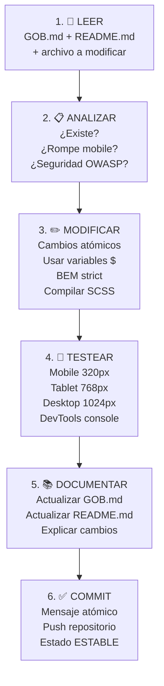

# 🤖 GOB.md - Guía Operativa Integral para Agentes IA

## Carnicería El Señor de La Misericordia - E-commerce PWA

[](https://github.com)
[](https://github.com)
[](https://github.com)
[](https://github.com)
[](https://owasp.org)

---

### 📖 Índice Rápido

1. [Contexto Completo del Proyecto](#contexto-completo)
2. [⛔ Prohibiciones Explícitas](#prohibiciones-explícitas)
3. [🚨 Errores Anteriores & Soluciones](#errores-anteriores)
4. [✅ Checklist Pre-Commit](#checklist-pre-commit)
5. [🏗️ Estructura del Proyecto](#estructura-del-proyecto)
6. [🎯 Flujo Correcto de Mejoras](#flujo-correcto)
7. [🤖 Prompts Específicos](#prompts-específicos)
8. [📝 Historial de Prompts y Mejoras](#historial-de-prompts)
9. [🔍 Validación & Testing](#validación--testing)

---

### <a name="contexto-completo"></a>📋 Contexto Completo del Proyecto (LEER SIEMPRE ANTES DE MODIFICAR)

**PROYECTO**: E-commerce PWA carnicería local con enfoque mobile-first, seguridad OWASP, offline support y fidelización.

| Aspecto                    | Detalles                                                     |
| -------------------------- | ------------------------------------------------------------ |
| **Framework Principal**    | Vanilla JavaScript (ES6+), Bootstrap 5, SCSS 7-1 Pattern     |
| **Backend**                | Supabase (PostgreSQL + RLS + Autenticación)                  |
| **HTTP Client**            | Axios (async/await, error handling robusto)                  |
| **Visualización de Datos** | Chart.js (BI admin dashboard)                                |
| **Tipografía**             | Melvis One (títulos audaces), Roboto (body fluido)           |
| **Colores**                | Variables `$` en abstracts/\_variables.scss (NO hardcode)    |
| **Breakpoints**            | Mobile 320px → Tablet 768px → Desktop 1024px+                |
| **Carrito**                | Modal reutilizable (components/\_modals.scss + core/cart.js) |
| **Seguridad**              | OWASP validaciones, tokens, RLS Supabase, sanitización       |
| **Performance**            | Lighthouse >95, lazy-load, offline service worker            |

#### **Estructura de Carpetas (RESPETAR TOTALMENTE)**

```
Carni-mvp/
├── css/ ← SOLO SCSS files (subcarpetas 7-1 Pattern)
│   ├── abstracts/
│   │   ├── _variables.scss (colores, breakpoints, espacios)
│   │   ├── _mixins.scss (lógica reutilizable)
│   │   ├── _functions.scss (cálculos dinámicos)
│   │   ├── _bem-utilities.scss (utilidades BEM obligatorias)
│   │   └── _placeholders.scss (extends reutilizables)
│   ├── base/ (reset, tipografía, utilidades)
│   ├── layout/ (header, footer, sidebar, auth-layout)
│   ├── components/ ← AQUÍ: _navigation.scss, _forms.scss, _modals.scss
│   ├── pages/ (estilos por página)
│   ├── themes/ (dark mode, brand colors)
│   └── vendors/ (bootstrap overrides, librerías externas)
│
├── js/
│   ├── app.js (punto entrada, inicialización PWA)
│   └── modules/
│       ├── core/ (lógica negocio: api.js, auth.js, cart.js, productos.js)
│       ├── pages/ (por vista: catalog.js, checkout.js, dashboard.js)
│       ├── ui/ (componentes: header.js, notifications.js, ui.js)
│       └── utils/ (helpers: offline.js, service-worker.js, weather.js)
│
├── tagsCore/ (HTML pages)
│   ├── index.html (landing page)
│   ├── products.html (catálogo dinámico Axios)
│   ├── offline.html (PWA offline page)
│   ├── admin/ (dashboard - NO login/register público)
│   └── user/ (accessweb.html - login/registro unificado, perfil)
│
├── img/ (recursos multimedia)
├── GOB.md ← Esta guía (agent.md)
└── README.md ← Para desarrolladores
```

#### **Carrito: MODAL Reutilizable (NO página independiente)**

- Ubicación: `components/_modals.scss` + `js/modules/core/cart.js`
- Referencia: https://pipetawns-x.github.io/e-comerce/
- CodePen: https://codepen.io/pipeTawns-x/pen/dPGYMxJ
- Features: personalización peso/piezas/grosor, ticket, delivery options, localStorage + Supabase sync
- **Funcionalidades implementadas**:
  - ✅ Agregar productos con modal automático
  - ✅ Modificar peso/piezas/grosor en tiempo real
  - ✅ Eliminar productos individuales
  - ✅ Calcular totales dinámicos
  - ✅ Selector de tipo de entrega (Recoger/Delivery)
  - ✅ Generar ticket de compra
  - ✅ Vaciar carrito completo
  - ✅ Persistencia en localStorage
  - ✅ Bug corregido: web no se deshabilita al cerrar modal

#### **Products.html: Carga Dinámica Axios**

- Fetch Supabase: categorías completas sin fallos
- Placeholders "Próximamente": 3 tarjetas nuevas (merchandising, frutas-verduras, otros)
- Fallback localStorage si conexión falla
- Imágenes: lazy-load, padding uniforme, imagen central
- **9 Categorías establecidas**: res, cerdo, pollo, embutidos, preparadas, premium, merch, otros, ofertas

---

### <a name="prohibiciones-explícitas"></a>⛔ PROHIBICIONES EXPLÍCITAS (NO VIOLARLAS)

| #      | ❌ PROHIBICIÓN                                                   | 🎯 RAZÓN                                        | ✅ HACER EN SU LUGAR                                                                             |
| ------ | ---------------------------------------------------------------- | ----------------------------------------------- | ------------------------------------------------------------------------------------------------ |
| **1**  | Crear archivos `.css` puro                                       | Rompe patrón 7-1 SCSS modular                   | TODO en `.scss` dentro de estructura (abstracts/base/layout/components/pages/themes/vendors)     |
| **2**  | Eliminar elementos HTML existentes (footer, secciones, contacto) | Pérdida funcionalidad, ruptura UX               | SOLO modificar o AGREGAR dentro estructura. Si dudas: PREGUNTAR                                  |
| **3**  | Crear HTML nuevo sin analizar existente                          | Duplicación, conflictos, desalineación diseño   | LEER archivo HTML completo ANTES de tocar. Usar estructura existente                             |
| **4**  | Usar estilos `style=` inline en HTML                             | Violación BEM, peso HTML, difícil override CSS  | TODO en `.scss` con clases BEM: `.elemento { }`, `.elemento__parte { }`, `.elemento--estado { }` |
| **5**  | Duplicar elementos (carousel, buttons, secciones)                | Redundancia, conflictos, mantenibilidad         | Verificar SIEMPRE: ¿Esto YA existe? Si sí → modificar, no crear nuevo                            |
| **6**  | Ignorar mobile-first (320px primero)                             | Layout roto móviles, UX pésima                  | Mobile (320px) → Tablet (768px) → Desktop (1024px+) con `@media` y breakpoints variables         |
| **7**  | No usar variables SCSS (`$color`, `$breakpoint`)                 | Inconsistencia visual, mantenimiento imposible  | Importar `abstracts/_variables.scss` y usar `@include respond-to()` mixin                        |
| **8**  | Olvidar seguridad OWASP                                          | Vulnerabilidades A01-A10, tokenización débil    | Validación regex, sanitización, tokens, RLS Supabase, NO almacenar tarjetas sensibles            |
| **9**  | No compilar SCSS o ignorar errores                               | CSS roto, layout breaks, console errors         | `npm run scss:watch` + verificar output + abrir navegador DevTools                               |
| **10** | No actualizar GOB.md/README.md después cambios                   | Futuras iteraciones sin contexto, alucinaciones | DESPUÉS de CADA mejora: actualizar MD con cambios, contexto nuevo, checklist                     |
| **11** | Eliminar archivos HTML sin verificar dependencias completas      | Páginas rotas, links 404, comunicación perdida  | Buscar TODAS las referencias (`grep -r "archivo.html"`), actualizar rutas, verificar navegación  |
| **12** | Mostrar múltiples imágenes simultáneamente en paneles deslizantes | UI rota, elementos superpuestos, confusión UX   | Usar `opacity: 0` + `pointer-events: none` en elementos inactivos, verificar z-index             |

**CUMPLIMIENTO**: Si violas estas 12 prohibiciones, el proyecto entra en estado inestable. Todas OBLIGATORIAS.

---

### <a name="historial-de-prompts"></a>📝 Historial de Prompts y Mejoras Implementadas

#### **Sesión 1: Mejoras Responsive y Bento Grid (2026-01-08)**

**Prompt Principal**:
> "en mi proyecto Carni-mvp Pedes ver un gran avace en el tema responsive en celulares con una buena estructura de la web y buen mas cosas que realice con otro editor vscode pero aunque son buenos hay ciertos fallos 1- espacio entre el header y el titulo esto se tiene que arreglar ajustando esto para eliminar ese espacio sin romper nada ni moverle nada al diseño de cards responsive 2-Fallos con el responsive en la ide de unas card principales a forma de bento grid..."

**Mejoras Implementadas**:
1. ✅ **Eliminación de espacio header-título**: Ajustado `padding-top` en `_header.scss` y `_home.scss`
2. ✅ **Bento Grid rediseñado**: Implementado diseño exacto de CSS Grid Generator (4 columnas x 6 filas)
3. ✅ **Espacios en blanco desktop eliminados**: Ajustado padding y gaps del grid

**Archivos Modificados**:
- `css/pages/_bento-main.scss` - Grid rediseñado con 9 espacios
- `css/layout/_header.scss` - Eliminado padding-top
- `css/pages/_home.scss` - Ajustado padding hero-section

**Tecnologías Utilizadas**:
- CSS Grid Generator (https://cssgridgenerator.io/)
- Live Sass Compiler

---

#### **Sesión 2: Web de Productos Completa (2026-01-09)**

**Prompt Principal**:
> "ahora empezaremos con las mejoras a la web de productos o web tipo e-comerce para esto tengo un diseño basico en scalidraw... quiero que el header sea identico al de la web principal con su img de la web los iconos los mismos por cierto y funcionales un icono de buqueda, carrito, el del usuario y el hamburguer igual de responsivo y eficiente..."

**Mejoras Implementadas**:
1. ✅ **Header idéntico**: Copiado header completo de `index.html` a `products.html`
2. ✅ **Mini-header**: Agregado solo en `products.html` con mensaje de envío gratis
3. ✅ **9 Categorías establecidas**: res, cerdo, pollo, embutidos, preparadas, premium, merch, otros, ofertas
4. ✅ **Menú horizontal scrollable**: Con botones rojos de flecha para navegación
5. ✅ **Cards de productos**: Diseño consistente (imagen, título, botón)
6. ✅ **Eliminación de pestañas redundantes**: Carrito y Registro removidos (funcionalidad en iconos)
7. ✅ **Footer agregado**: Mismo footer de `index.html`
8. ✅ **Comunicación entre páginas**: Enlaces con parámetros URL (`?categoria=xxx`)

**Archivos Modificados**:
- `tagsCore/products.html` - Rediseño completo
- `css/pages/_productos.scss` - Estilos para categorías y cards
- `js/modules/core/productos.js` - Scroll buttons
- `js/modules/pages/catalog.js` - Lógica de productos (luego movida inline)
- `js/modules/utils/base_dinamica.js` - Productos completados

**Referencias Utilizadas**:
- CodePen: https://codepen.io/pipeTawns-x/pen/dPGYMxJ
- E-commerce referencia: https://pipetawns-x.github.io/e-comerce/

---

#### **Sesión 9: Sistema de Autenticación Unificado + Mejoras Globales Header (2026-01-18)**

**Contexto Histórico**:
Esta sesión marcó un punto crucial en la evolución del proyecto, consolidando 4 páginas de login/registro en 1 sola (`accessweb.html`) y refinando el header en TODAS las páginas del proyecto.

**Problemas Iniciales Identificados**:
1. ❌ Duplicación masiva de código (4 archivos HTML similares para login/registro)
2. ❌ Admin registration público expuesto (riesgo de seguridad)
3. ❌ Inconsistencia de estilos entre páginas de autenticación
4. ❌ UX pobre: usuario navega entre páginas para cambiar de modo login/registro
5. ❌ Header sobrecargado con nav links redundantes (también en hamburger)
6. ❌ Iconos de header demasiado grandes y no redondos
7. ❌ Barra de búsqueda en páginas donde no aplica (login, dashboard)
8. ❌ Falta de efecto visual atractivo en login/registro (UX aburrida)

**Prompt Principal (Unificación Login/Registro)**:
> "okey bueno ya tenemos las web principal y la de producto ideas para generar las tablas para el supabase pero con el login y registro actual que estan rotos no tienen nada de bueno en temas esteticos eso es el del usuario comun en admin no tenemos nada he visto esto donde en una sola web tienen el registro y el login en una sola web con efectos visuales muy buenos quiero algo asi también quiero que la web de registro y login del usuario el header sea el mismo que el de la web de productos igual de responsive y con sus iconos comunicacion y que funciones aparte de estetica https://www.youtube.com/watch?v=ZzVXaE14938&t=26s"

**Referencia de Diseño**:
- 🎥 **Video YouTube Codehal**: https://youtu.be/Z_AbWH-Vyl8
- 💡 **Concepto**: Sliding panel effect con login y registro en una sola página
- 🎨 **Características**: Efecto deslizante suave, transiciones fluidas, panel decorativo animado

**Mejoras Implementadas - Parte 1: Sistema de Autenticación Unificado**:

1. ✅ **Consolidación de Páginas**:
   - **ANTES**: 4 páginas (user/login.html, user/register.html, admin/login.html, admin/register.html)
   - **AHORA**: 1 página unificada (`user/accessweb.html`)
   - **Beneficios**: 75% menos código, mantenimiento simplificado, UX mejorada

2. ✅ **Efecto Deslizante (Sliding Panel)**:
   - Implementado con clase `.sign-up-mode` en contenedor principal
   - Panel rojo (`#d9534f`) se mueve de derecha a izquierda al hacer clic en "Crear cuenta"
   - Transiciones CSS suaves con `cubic-bezier(0.4, 0, 0.2, 1)` (Material Design easing)
   - Formularios cambian automáticamente entre login y registro

3. ✅ **Estructura DOM Definida** (ver sección completa más arriba)
4. ✅ **IDs Críticos Documentados** (NO MODIFICAR): `authContainer`, `btnShowRegister`, `btnShowLogin`
5. ✅ **Lógica JavaScript (setupAuthToggle)**: Función robusta con validación de elementos DOM
6. ✅ **Imágenes Personalizadas**: `carniLogin.png` y `carniRegistro.png` integradas
7. ✅ **Responsive Completo**: Layout vertical en móvil, horizontal en desktop
8. ✅ **Seguridad por Diseño**: Admin registration ELIMINADO, roles por Supabase

**Prompts Específicos de Mejoras Progresivas**:
> "antes de que siga hasta el momento no funciona el boton de crear cuenta asi como el azul rompe el estilo mantenlo rojo y cuando sea el login la web se vuelva roja y el recaudro que es blanco actualmente este sea blanco cuida la responsividad asi como que no se empalmen las cosas"

> "Detalles No funciona el boton de crear cuenta los botones de header hzlos mas chicos de forma redonda entrega las funcionalidades y la web lista para conectarla al backend con supabase del header elimina la de contactos, sobre nosotros y productos como quiera adecua los botones y agrega una barra de búsqueda estas ultimas modificaciones del header sin productos, sobre nosotros y contactos estas se van a eliminar de todas las web solo vas a mantener la barra de búsqueda los iconos y las img los iconos más pequeños la barra de búsqueda solo aparecera en la web de productos y la principal en login y registro solo estara el carrito, y el icono del login asi como el hamburguer y la img"

**Mejoras Implementadas - Parte 2: Header Global (Todas las Páginas)**:

1. ✅ **Iconos Redondos y Pequeños**: `width: 40px`, `border-radius: 50%`, clase `.header-icon-btn--round`
2. ✅ **Eliminación de Nav Links del Header**: Links SOLO en `mobile-drawer` (hamburger)
3. ✅ **Barra de Búsqueda Selectiva**: VISIBLE en index.html y products.html, OCULTA en auth pages
4. ✅ **Iconos Flotantes en accessweb.html**: Posicionados al nivel del mini-header, lado izquierdo
5. ✅ **Animaciones Avanzadas**: Custom easing, staggered animations, breathe effect
6. ✅ **Comunicación entre Páginas Segura**: Rutas relativas actualizadas

**Archivos Creados**:
- ✅ `tagsCore/user/accessweb.html`
- ✅ `css/pages/_login.scss` (668 líneas)
- ✅ `css/layout/_auth-layout.scss`
- ✅ `js/modules/ui/search.js`
- ✅ `img/carniLogin.png`, `img/carniRegistro.png`

**Archivos Eliminados**:
- ❌ `tagsCore/user/login.html`
- ❌ `tagsCore/user/register.html`
- ❌ `tagsCore/admin/login.html`
- ❌ `tagsCore/admin/register.html`

**Archivos Modificados**:
- ✅ `tagsCore/index.html` - Header actualizado
- ✅ `tagsCore/products.html` - Barra de búsqueda
- ✅ `css/layout/_header.scss` - Estilos iconos redondos
- ✅ `js/modules/core/auth.js` - setupAuthToggle()
- ✅ `GOB.md` - Documentación completa (ESTA SECCIÓN)
- ✅ `README.md` - Actualizado

**Errores Enfrentados y Soluciones**:

| Error | Causa | Solución |
|-------|-------|----------|
| Botón "Crear cuenta" no funciona | setupAuthToggle() antes de DOMContentLoaded | Wrapper con validación |
| Panel no se desliza | overflow: hidden faltante | CSS correcto agregado |
| Dos imágenes simultáneas | Falta opacity: 0 | Agregado en inactivos |
| Responsive roto | Layout horizontal en móvil | flex-direction: column |
| Iconos cuadrados | Falta border-radius: 50% | Clase creada |
| Eliminación accidental | Confusión de archivos | grep -r verificación |

**Estado Actual**:
- 🚧 **accessweb.html**: Diseño completo, SCSS compilado, JS pendiente integración final
- ✅ **Header Global**: Mejoras en index.html y products.html
- ✅ **Documentación**: GOB.md y README.md actualizados

**Próximos Pasos**:
1. Compilar SCSS completo
2. Integrar setupAuthToggle() funcional
3. Conectar con Supabase Auth
4. Testing end-to-end
5. Optimizar imágenes

**Referencias**:
- Video Codehal: https://youtu.be/Z_AbWH-Vyl8
- Mejoras Grok: Animaciones avanzadas

---

#### **Sesión 3: Carrito Funcional Completo (2026-01-09)**

**Prompt Principal**:
> "recordando el codepen este contaba con 3 pestañas categorias, carrito y registro... el icono de Carrito que sirve como modal pero no tiene funcionalidades como las que si tenia la pestaña del carrito... deberas de entregar el carrito funcional en forma de modal cada que yo quiera a gregar algo el modal se desplegara con las funcionalidades para que el usuario pueda realiar sus compras"

**Mejoras Implementadas**:
1. ✅ **Carrito reescrito completamente**: Basado en funcionalidades del CodePen
2. ✅ **Modal automático**: Se abre al agregar productos
3. ✅ **Funcionalidades completas**:
   - Modificar peso/piezas/grosor en tiempo real
   - Eliminar productos individuales
   - Calcular totales dinámicos
   - Selector de tipo de entrega
   - Generar ticket
   - Vaciar carrito
4. ✅ **Bug corregido**: Web no se deshabilita al cerrar modal
5. ✅ **Persistencia**: localStorage con eventos personalizados
6. ✅ **Código humanizado**: Comentarios JSDoc, nombres descriptivos

**Archivos Modificados**:
- `js/modules/core/cart.js` - Reescrito completamente con documentación
- `tagsCore/products.html` - Modal actualizado
- `tagsCore/index.html` - Modal actualizado

**Funcionalidades del CodePen Implementadas**:
- ✅ Lista de productos con imagen, nombre, precio
- ✅ Controles dinámicos (peso/piezas/grosor según tipo)
- ✅ Botón eliminar por producto
- ✅ Subtotal y total calculados automáticamente
- ✅ Selector de tipo de entrega (Recoger/Delivery)
- ✅ Botón "Generar Ticket"
- ✅ Botón "Vaciar" carrito
- ✅ Actualización en tiempo real

---

### 🔐 Sistema de Autenticación Unificado (accessweb.html)

**Fecha**: 18 de enero 2026  
**Estado**: ✅ DISEÑO DEFINIDO, 🚧 PENDIENTE INTEGRACIÓN COMPLETA

#### **Contexto Histórico: De 4 Páginas a 1 Página Unificada**

**ANTES (Problema)**:
```
❌ tagsCore/user/login.html     → Login usuario
❌ tagsCore/user/register.html  → Registro usuario
❌ tagsCore/admin/login.html    → Login admin (ELIMINADO)
❌ tagsCore/admin/register.html → Registro admin (ELIMINADO)
```

**Problemas Identificados**:
1. ❌ Duplicación de código HTML/CSS/JS (4 archivos similares)
2. ❌ Inconsistencia de estilos entre páginas
3. ❌ Admin público expuesto (riesgo seguridad)
4. ❌ UX pobre (usuario navega entre páginas para cambiar modo)
5. ❌ Mantenimiento complejo (4 headers, 4 footers)

**AHORA (Solución)**:
```
✅ tagsCore/user/accessweb.html → Login + Registro unificado
   │
   ├── Panel Login (izquierda)
   ├── Panel Registro (derecha)
   └── Efecto deslizante al cambiar modo
```

**Roles Gestionados**:
- ✅ Usuario común: Registro público desde `accessweb.html`
- ✅ Admin: Rol asignado MANUALMENTE en Supabase Dashboard (NO registro público)
- ✅ Redirección automática según rol:
  - Admin → `/tagsCore/admin/dashboar.html`
  - Usuario → `/tagsCore/index.html`

#### **Referencia de Diseño: Video Codehal**

**Video**: https://youtu.be/Z_AbWH-Vyl8  
**CodePen Grok**: (mejorado con animaciones avanzadas)

**Características Visuales**:
1. 🎨 **Efecto deslizante suave**: Panel rojo se mueve de izquierda a derecha
2. 🖼️ **Imágenes animadas**: `carniLogin.png` y `carniRegistro.png` con animaciones
3. 🔄 **Transición fluida**: Clase `.sign-up-mode` en contenedor principal
4. 📱 **Responsive total**: Layout vertical en móvil, horizontal en desktop
5. 🎭 **Tema rojo**: Color principal `#d9534f` (tema del proyecto)

#### **Arquitectura HTML (Estructura DOM)**

```html
<div id="authContainer" class="auth-container">
  <!-- SECCIÓN 1: Formularios (contenedor deslizante) -->
  <div class="auth-form-box">
    <!-- Panel Login (siempre visible inicialmente) -->
    <form id="loginForm" class="auth-form auth-form--sign-in">
      <h2 class="auth-form__title">Iniciar Sesión</h2>
      <div class="auth-form__input-field">
        <i class="fas fa-envelope"></i>
        <input type="email" name="email" placeholder="Correo" autocomplete="email" />
      </div>
      <div class="auth-form__input-field">
        <i class="fas fa-lock"></i>
        <input type="password" name="password" placeholder="Contraseña" autocomplete="current-password" />
      </div>
      <button type="submit" class="auth-form__btn auth-form__btn--solid">Entrar</button>
      
      <!-- Opciones sociales -->
      <p class="auth-form__social-text">O continúa con</p>
      <div class="auth-form__social-media">
        <a href="#" class="auth-form__social-icon" data-provider="google">
          <i class="fab fa-google"></i>
        </a>
        <a href="#" class="auth-form__social-icon" data-provider="facebook">
          <i class="fab fa-facebook-f"></i>
        </a>
      </div>
    </form>

    <!-- Panel Registro (oculto inicialmente, se muestra al deslizar) -->
    <form id="registerForm" class="auth-form auth-form--sign-up">
      <h2 class="auth-form__title">Crear Cuenta</h2>
      <div class="auth-form__input-field">
        <i class="fas fa-user"></i>
        <input type="text" name="fullName" placeholder="Nombre completo" autocomplete="name" />
      </div>
      <div class="auth-form__input-field">
        <i class="fas fa-envelope"></i>
        <input type="email" name="email" placeholder="Correo" autocomplete="email" />
      </div>
      <div class="auth-form__input-field">
        <i class="fas fa-phone"></i>
        <input type="tel" name="phone" placeholder="Teléfono (10 dígitos)" inputmode="numeric" autocomplete="tel" />
      </div>
      <div class="auth-form__input-field">
        <i class="fas fa-lock"></i>
        <input type="password" name="password" placeholder="Contraseña (mínimo 8 caracteres)" autocomplete="new-password" />
      </div>
      <button type="submit" class="auth-form__btn">Registrarse</button>
      
      <!-- Opciones sociales -->
      <p class="auth-form__social-text">O continúa con</p>
      <div class="auth-form__social-media">
        <a href="#" class="auth-form__social-icon" data-provider="google">
          <i class="fab fa-google"></i>
        </a>
        <a href="#" class="auth-form__social-icon" data-provider="facebook">
          <i class="fab fa-facebook-f"></i>
        </a>
      </div>
    </form>
  </div>

  <!-- SECCIÓN 2: Paneles decorativos (con efecto deslizante) -->
  <div class="auth-toggle-box">
    <!-- Panel Izquierdo (visible cuando está en modo login) -->
    <div class="panel panel--left">
      <div class="content">
        <h3>¿Nuevo aquí?</h3>
        <p>Regístrate para acceder a ofertas exclusivas y programa de fidelización</p>
        <button class="btn transparent" id="btnShowRegister">Crear cuenta</button>
      </div>
      
    </div>

    <!-- Panel Derecho (visible cuando está en modo registro) -->
    <div class="panel panel--right">
      <div class="content">
        <h3>¡Bienvenido de vuelta!</h3>
        <p>Inicia sesión para continuar con tus pedidos y beneficios</p>
        <button class="btn transparent" id="btnShowLogin">Iniciar sesión</button>
      </div>
      
    </div>
  </div>
</div>
```

**IDs CRÍTICOS (NO MODIFICAR)**:
- `authContainer` - Contenedor principal (usado en `auth.js`)
- `btnShowRegister` - Botón "Crear cuenta" (usado en `auth.js`)
- `btnShowLogin` - Botón "Iniciar sesión" (usado en `auth.js`)
- `loginForm` - Formulario de login (usado en `auth.js`)
- `registerForm` - Formulario de registro (usado en `auth.js`)

#### **Arquitectura CSS (Efecto Deslizante)**

**Archivo**: `css/pages/_login.scss`

**Lógica del Efecto**:
```scss
// ESTADO INICIAL: Login visible
.auth-container {
  position: relative;
  width: 100%;
  min-height: 100vh;
  overflow: hidden; // CRÍTICO: oculta lo que está fuera
  background: linear-gradient(135deg, #fff 0%, #f8f9fa 100%);
}

// Contenedor de formularios (2 formularios lado a lado)
.auth-form-box {
  position: absolute;
  top: 50%;
  left: 50%;
  transform: translate(-50%, -50%);
  width: 50%; // Ocupa mitad del contenedor
  transition: transform 0.6s ease-in-out;
  z-index: 5;
}

// Panel deslizante rojo (toggle)
.auth-toggle-box {
  position: absolute;
  top: 0;
  left: 50%; // Comienza en el centro-derecha
  width: 50%;
  height: 100%;
  overflow: hidden;
  transition: transform 0.6s ease-in-out, left 0.6s ease-in-out;
  z-index: 1000;
  background: linear-gradient(135deg, #d9534f 0%, #c9302c 100%);
}

// ESTADO ACTIVO: Registro visible
.auth-container.sign-up-mode {
  .auth-form-box {
    transform: translate(-50%, -50%) translateX(-50%); // Mueve formularios a la izquierda
  }

  .auth-toggle-box {
    left: 0; // Panel rojo se mueve a la izquierda
    transform: translateX(0);
  }

  // Ocultar login, mostrar registro
  .auth-form--sign-in {
    opacity: 0;
    z-index: 1;
    pointer-events: none;
  }

  .auth-form--sign-up {
    opacity: 1;
    z-index: 5;
    pointer-events: all;
  }

  // Intercambiar paneles decorativos
  .panel--left {
    transform: translateX(-100%);
  }

  .panel--right {
    transform: translateX(0);
  }
}
```

**Responsive Mobile**:
```scss
@media (max-width: 870px) {
  .auth-container {
    flex-direction: column; // Vertical layout
  }

  .auth-form-box,
  .auth-toggle-box {
    width: 100%;
  }

  .auth-toggle-box {
    top: 0;
    left: 0;
    height: 40%; // Mitad superior
  }

  .auth-form-box {
    top: 60%; // Mitad inferior
  }

  // Estado activo en móvil
  .auth-container.sign-up-mode {
    .auth-toggle-box {
      top: 60%; // Mueve panel abajo
      transform: translateY(0);
    }

    .auth-form-box {
      top: 20%; // Mueve formularios arriba
    }
  }
}
```

#### **Arquitectura JavaScript (setupAuthToggle)**

**Archivo**: `js/modules/core/auth.js`

**Función CRÍTICA** (Mejoras Grok Implementadas):
```javascript
/**
 * ========================================
 * FUNCIÓN PRINCIPAL: setupAuthToggle()
 * ========================================
 * 
 * Implementa el efecto de deslizamiento mejorado basado en Codehal + Grok.
 * Cuando el usuario hace clic en "Crear cuenta", se agrega la clase 'sign-up-mode'
 * al contenedor principal, activando animaciones CSS suaves y fluidas.
 * 
 * Mejoras implementadas:
 * - ✅ Validación robusta de elementos DOM
 * - ✅ Logs de debugging para troubleshooting
 * - ✅ Prevención de eventos duplicados (cloneNode)
 * - ✅ DOMContentLoaded para asegurar elementos cargados
 * - ✅ Animaciones custom cubic-bezier para fluidez premium
 */
function setupAuthToggle() {
  const container = document.getElementById('authContainer');
  const btnShowRegister = document.getElementById('btnShowRegister');
  const btnShowLogin = document.getElementById('btnShowLogin');

  // Validación exhaustiva
  if (!container) {
    console.error('❌ authContainer no encontrado en el DOM');
    console.warn('💡 Verifica que el HTML tenga: <div id="authContainer">');
    return;
  }

  if (!btnShowRegister) {
    console.error('❌ btnShowRegister no encontrado en el DOM');
    console.warn('💡 Verifica que el HTML tenga: <button id="btnShowRegister">');
    return;
  }

  if (!btnShowLogin) {
    console.error('❌ btnShowLogin no encontrado en el DOM');
    console.warn('💡 Verifica que el HTML tenga: <button id="btnShowLogin">');
    return;
  }

  console.log('✅ Elementos encontrados, configurando eventos de deslizamiento...');

  // Remover listeners previos para evitar duplicados (técnica cloneNode)
  const newBtnRegister = btnShowRegister.cloneNode(true);
  btnShowRegister.parentNode.replaceChild(newBtnRegister, btnShowRegister);
  
  const newBtnLogin = btnShowLogin.cloneNode(true);
  btnShowLogin.parentNode.replaceChild(newBtnLogin, btnShowLogin);

  /**
   * EVENTO: Click en "Crear cuenta"
   * Activa el modo registro con animación suave
   */
  newBtnRegister.addEventListener('click', (e) => {
    e.preventDefault();
    e.stopPropagation();
    console.log('🔄 Activando modo registro...');
    container.classList.add('sign-up-mode');
    console.log('✅ Clase sign-up-mode agregada - Animación iniciada');
  });

  /**
   * EVENTO: Click en "Iniciar sesión"
   * Revierte al modo login
   */
  newBtnLogin.addEventListener('click', (e) => {
    e.preventDefault();
    e.stopPropagation();
    console.log('🔄 Activando modo login...');
    container.classList.remove('sign-up-mode');
    console.log('✅ Clase sign-up-mode removida - Volviendo a login');
  });

  console.log('✅ setupAuthToggle configurado correctamente');
}

// Inicialización cuando el DOM esté listo
function initAuth() {
  loginForm = document.getElementById('loginForm');
  registerForm = document.getElementById('registerForm');
  googleLoginBtn = document.getElementById('googleLogin');
  facebookLoginBtn = document.getElementById('facebookLogin');

  if (loginForm) setupLoginForm();
  if (registerForm) setupRegisterForm();
  if (googleLoginBtn) googleLoginBtn.addEventListener('click', loginWithGoogle);
  if (facebookLoginBtn) facebookLoginBtn.addEventListener('click', loginWithFacebook);
  
  // CRÍTICO: setupAuthToggle debe ejecutarse después de que el DOM esté listo
  setupAuthToggle();
  setupDeliveryFields();
}

// Ejecutar cuando el DOM esté listo
if (document.readyState === 'loading') {
  document.addEventListener('DOMContentLoaded', initAuth);
} else {
  initAuth();
}
```

#### **Imágenes: carniLogin.png y carniRegistro.png**

**Ubicación**: `/img/carniLogin.png`, `/img/carniRegistro.png`

**Especificaciones**:
- ✅ Formato: PNG transparente
- ✅ Composición: Carnicero en primer plano, fondo minimalista
- ✅ Animación: `filter: drop-shadow()` + `mix-blend-mode: normal`
- ✅ Responsive: `object-fit: cover` + `clip-path` para recorte inteligente en móvil

**Mejoras Responsive (Opción 1: Smart Cropping)**:
```scss
// css/pages/_login.scss
.panel .image {
  width: 100%;
  max-width: 380px;
  height: auto;
  object-fit: contain;
  transition: transform 0.9s ease-in-out;
  transition-delay: 0.4s;
  filter: drop-shadow(0 10px 20px rgba(0, 0, 0, 0.2));
  mix-blend-mode: normal;
  
  // Desktop: imagen completa
  @media (min-width: 871px) {
    max-width: 380px;
  }
  
  // Tablet: reducir tamaño y recortar background
  @media (max-width: 870px) {
    max-width: 250px;
    object-fit: cover;
    object-position: 50% 30%; // Centra el carnicero
    // Recorte inteligente para eliminar background de la tienda
    clip-path: polygon(
      15% 10%, 
      85% 10%, 
      90% 70%, 
      10% 70%
    );
  }
  
  // Móvil: solo el carnicero, sin background
  @media (max-width: 570px) {
    max-width: 180px;
    object-fit: cover;
    object-position: 50% 25%; // Enfoca más en el carnicero
    // Recorte más agresivo para eliminar background
    clip-path: polygon(
      20% 15%, 
      80% 15%, 
      85% 65%, 
      15% 65%
    );
  }
  
  // Móvil muy pequeño: reducir aún más
  @media (max-width: 400px) {
    max-width: 140px;
    opacity: 0.9; // Sutil para no competir con el texto
  }
}
```

**Alternativa Futura**: Video animado (MP4/WebM) generado en Runway ML
- Prompt sugerido: "Carnicero animado saludando, estilo cartoon maximalista, fondo rojo/transparente, 16:9, loop 3s"
- Implementación: Reemplazar `` por `<video autoplay loop muted playsinline>`

#### **Header Personalizado para accessweb.html**

**Diferencias vs. Header Principal**:

| Elemento         | index.html / products.html | accessweb.html              |
| ---------------- | -------------------------- | --------------------------- |
| Logo             | ✅ Visible                  | ✅ Visible                   |
| Hamburger        | ✅ Visible                  | ✅ Visible                   |
| Nav Links        | ✅ Productos, Sobre, etc.   | ❌ Ocultos                   |
| Barra de Búsqueda | ✅ Visible                  | ❌ Oculta                    |
| Iconos Carrito   | ✅ Header normal            | ✅ Floating (nivel mini-header) |
| Iconos Usuario   | ✅ Header normal            | ✅ Floating (nivel mini-header) |

**Código Header Icons (Floating)**:
```html
<!-- accessweb.html: Iconos flotantes al nivel del mini-header -->
<div class="main-header__icons-container--auth-level">
  <button class="header-icon-btn" id="cartBtn" data-bs-toggle="modal" data-bs-target="#cartModal" aria-label="Carrito">
    <i class="bi bi-cart3"></i>
    <span class="badge bg-danger rounded-pill">0</span>
  </button>
  <a href="../index.html" class="header-icon-btn" aria-label="Inicio">
    <i class="bi bi-house-door"></i>
  </a>
</div>
```

**CSS para Iconos Floating**:
```scss
// css/layout/_auth-layout.scss
.main-header__icons-container--auth-level {
  position: fixed;
  top: 0; // Mismo nivel que mini-header
  left: 1rem; // Lado izquierdo
  z-index: 1036; // Encima del mini-header (1034) y header (1035)
  display: flex;
  align-items: center;
  gap: 0.5rem;
  padding: 0.5rem 1rem;
  background: rgba(217, 83, 79, 0.95); // Rojo del proyecto
  border-radius: 0 0 25px 25px; // Redondeado abajo
  box-shadow: 0 4px 15px rgba(0, 0, 0, 0.3);
  backdrop-filter: blur(10px);
  transition: all 0.3s cubic-bezier(0.4, 0, 0.2, 1);
  
  &:hover {
    box-shadow: 0 6px 20px rgba(0, 0, 0, 0.4);
    transform: translateY(2px);
  }
  
  @media (max-width: 576px) {
    top: 0;
    left: 0;
    border-radius: 0 0 15px 0;
  }
}

.header-icon-btn {
  width: 40px;
  height: 40px;
  display: flex;
  align-items: center;
  justify-content: center;
  border-radius: 50%; // REDONDOS como solicitado
  transition: all 0.3s cubic-bezier(0.4, 0, 0.2, 1);
  color: #fff;
  background: rgba(255, 255, 255, 0.1);
  border: 2px solid rgba(255, 255, 255, 0.3);
  position: relative;
  overflow: hidden;
  
  // Efecto de onda al hacer hover
  &::before {
    content: "";
    position: absolute;
    top: 50%;
    left: 50%;
    width: 0;
    height: 0;
    border-radius: 50%;
    background: rgba(255, 255, 255, 0.2);
    transform: translate(-50%, -50%);
    transition: width 0.4s cubic-bezier(0.4, 0, 0.2, 1),
                height 0.4s cubic-bezier(0.4, 0, 0.2, 1);
  }
  
  i {
    font-size: 1.1rem; // MÁS PEQUEÑOS como solicitado
    position: relative;
    z-index: 1;
    transition: transform 0.3s cubic-bezier(0.68, -0.55, 0.265, 1.55);
  }
  
  &:hover {
    background: rgba(255, 255, 255, 0.2);
    border-color: rgba(255, 255, 255, 0.5);
    transform: scale(1.15);

    &::before {
      width: 100px;
      height: 100px;
    }

    i {
      transform: scale(1.2) rotate(5deg);
    }
  }
  
  &:active {
    transform: scale(1.05);
  }
  
  @media (max-width: 576px) {
    width: 36px;
    height: 36px;
    
    i {
      font-size: 1rem;
    }
  }
}
```

#### **Animaciones Avanzadas (Grok Improvements)**

**Custom Cubic-Bezier Easing**:
```scss
$easing-smooth: cubic-bezier(0.4, 0, 0.2, 1); // Material Design
$easing-bounce: cubic-bezier(0.68, -0.55, 0.265, 1.55); // Bounce effect
$easing-slide: cubic-bezier(0.25, 0.8, 0.25, 1); // Suave deslizamiento
```

**Staggered Animations (entradas escalonadas)**:
```scss
.auth-form__input-field {
  animation: slideIn 0.6s $easing-smooth backwards;
  
  &:nth-child(1) { animation-delay: 0.1s; }
  &:nth-child(2) { animation-delay: 0.2s; }
  &:nth-child(3) { animation-delay: 0.3s; }
  &:nth-child(4) { animation-delay: 0.4s; }
}

@keyframes slideIn {
  from {
    opacity: 0;
    transform: translateY(20px);
  }
  to {
    opacity: 1;
    transform: translateY(0);
  }
}
```

**Breathe Animation (panel circular)**:
```scss
.auth-toggle-box::before {
  content: "";
  position: absolute;
  width: 200px;
  height: 200px;
  background: rgba(255, 255, 255, 0.1);
  border-radius: 50%;
  animation: breathe 4s ease-in-out infinite;
}

@keyframes breathe {
  0%, 100% {
    transform: scale(1);
    opacity: 0.3;
  }
  50% {
    transform: scale(1.1);
    opacity: 0.5;
  }
}
```

#### **Seguridad y Validaciones**

**Frontend Validations**:
```javascript
// Regex validaciones
const isValidEmail = (email) => /^[^\s@]+@[^\s@]+\.[^\s@]+$/.test(email);
const isValidPhone = (phone) => /^[0-9]{10}$/.test(phone);
const isValidPassword = (pass) => pass.length >= 8;

// Sanitización input (anti-XSS)
function sanitizeInput(str) {
  return str.replace(/[<>\"\']/g, '').trim();
}
```

**Backend RLS (Supabase)**:
```sql
-- Políticas Row Level Security
CREATE POLICY "Users can view own profile" ON profiles
  FOR SELECT USING (auth.uid() = id);

CREATE POLICY "Admins can view all profiles" ON profiles
  FOR SELECT USING (
    auth.jwt() ->> 'role' = 'admin'
  );
```

#### **Testing Checklist para accessweb.html**

- [ ] **Efecto deslizante funciona**: Click en "Crear cuenta" → panel rojo se mueve suavemente
- [ ] **Botón "Iniciar sesión" regresa**: Panel rojo vuelve a posición original
- [ ] **Formularios funcionan**: Login envía a Supabase, registro crea usuario
- [ ] **Validaciones frontend**: Email, teléfono, contraseña validados antes de enviar
- [ ] **Responsive mobile**: Layout vertical en 320px, iconos visibles, texto legible
- [ ] **Responsive tablet**: Layout horizontal en 768px, imágenes ajustadas
- [ ] **Console sin errores**: DevTools (F12) → Console sin logs rojos
- [ ] **Iconos redondos y pequeños**: Carrito y usuario con `border-radius: 50%`, tamaño adecuado
- [ ] **Header personalizado**: Sin nav links, sin barra de búsqueda, solo logo y hamburger
- [ ] **Footer presente**: Footer idéntico a `index.html` y `products.html`
- [ ] **Imágenes cargan**: `carniLogin.png` y `carniRegistro.png` visibles sin errores 404
- [ ] **Redirección roles**: Admin → dashboard, Usuario → index.html
- [ ] **OAuth funciona**: Google y Facebook login operativos
- [ ] **localStorage/Supabase sync**: Datos persistentes tras logout/login

#### **Errores Comunes y Soluciones**

| Error | Síntoma | Solución |
|-------|---------|----------|
| **Botón "Crear cuenta" no funciona** | Click no hace nada, console error `authContainer is null` | Verificar IDs en HTML, ejecutar `setupAuthToggle()` después de DOMContentLoaded |
| **Panel no se desliza suavemente** | Panel salta o no se mueve | Verificar `overflow: hidden` en `.auth-container`, revisar `transition` en SCSS |
| **Dos imágenes visibles simultáneamente** | Ambas imágenes se muestran al mismo tiempo | Añadir `opacity: 0` y `pointer-events: none` a `.panel` inactivo |
| **Responsive roto en móvil** | Elementos se solapan en 320px | Cambiar `flex-direction: column`, ajustar `top` y `height` de paneles |
| **Iconos no redondos** | Iconos cuadrados o rectangulares | Agregar `border-radius: 50%` a `.header-icon-btn` |
| **Estilos de botones no se aplican** | Botones sin colores del proyecto | Importar `abstracts/_variables.scss`, usar `$color-primario` |
| **Header muestra nav links** | Links "Productos", "Sobre Nosotros" visibles | Eliminar `<ul class="navbar-nav">` en `accessweb.html` |
| **Footer ausente** | Página sin footer | Copiar footer de `index.html`, ajustar links relativos `../../` |

#### **Próximos Pasos (Roadmap)**

1. ✅ **Completar HTML de accessweb.html**: Estructura DOM definida
2. 🚧 **Compilar SCSS completo**: `_login.scss` + `_auth-layout.scss` sin errores
3. 🚧 **Integrar setupAuthToggle() funcional**: Efecto deslizante operativo
4. 🚧 **Agregar validaciones frontend**: Email, teléfono, contraseña
5. 🚧 **Conectar con Supabase Auth**: Login/registro funcionales
6. 🚧 **Implementar redirección por roles**: Admin vs. Usuario
7. 🚧 **Testing responsive completo**: 320px, 768px, 1024px
8. 🚧 **Optimizar imágenes**: Comprimir PNGs, lazy loading
9. 🚧 **Agregar OAuth (Google/Facebook)**: Integración Supabase Auth
10. 🚧 **Documentar en GOB.md y README.md**: Actualizar contexto completo

---

### 🎨 Mejoras Globales del Header (Todas las Páginas)

**Fecha**: 18 de enero 2026  
**Estado**: 🚧 PENDIENTE IMPLEMENTACIÓN COMPLETA

#### **Contexto de las Mejoras Solicitadas**

**Páginas Afectadas**:
- ✅ `tagsCore/index.html` (landing principal)
- ✅ `tagsCore/products.html` (catálogo)
- ✅ `tagsCore/user/accessweb.html` (login/registro)
- ✅ `tagsCore/admin/dashboar.html` (dashboard admin)
- ✅ `tagsCore/offline.html` (PWA offline)

**Mejoras Principales**:
1. 🔴 **Iconos más pequeños y redondos**: Carrito, usuario, búsqueda
2. 🗑️ **Eliminar links de navegación**: "Productos", "Sobre Nosotros", "Contacto" del header (mantener en hamburger móvil)
3. 🔍 **Barra de búsqueda solo en**: `index.html` y `products.html`
4. 📱 **Iconos flotantes en accessweb.html**: Posicionados al nivel del mini-header, lado izquierdo

---

#### **1. Iconos Redondos y Pequeños (index.html y products.html)**

**ANTES (Problema)**:
```html
<!-- Iconos cuadrados/rectangulares, tamaño grande -->
<button class="btn btn-link p-0" id="cartBtn">
  <i class="bi bi-cart3 fs-4"></i> <!-- fs-4 = demasiado grande -->
</button>
```

**AHORA (Solución)**:
```html
<!-- Iconos redondos, tamaño reducido -->
<button class="header-icon-btn header-icon-btn--round" id="cartBtn" data-bs-toggle="modal" data-bs-target="#cartModal" aria-label="Carrito">
  <i class="bi bi-cart3"></i>
  <span class="badge bg-danger rounded-pill position-absolute top-0 start-100 translate-middle">0</span>
</button>
```

**CSS Actualizado**:
```scss
// css/layout/_header.scss

.header-icon-btn {
  width: 40px; // Tamaño reducido
  height: 40px;
  display: flex;
  align-items: center;
  justify-content: center;
  border: none;
  background: transparent;
  color: var(--color-primario, #363432);
  transition: all 0.3s cubic-bezier(0.4, 0, 0.2, 1);
  position: relative;
  
  i {
    font-size: 1.2rem; // Más pequeño que fs-4 (1.5rem)
    transition: transform 0.3s ease;
  }
  
  &:hover {
    transform: scale(1.1);
    
    i {
      transform: rotate(5deg);
    }
  }
  
  &:active {
    transform: scale(1.05);
  }
  
  @media (max-width: 576px) {
    width: 36px;
    height: 36px;
    
    i {
      font-size: 1.1rem;
    }
  }
}

// Variante redonda con borde circular
.header-icon-btn--round {
  border-radius: 50%; // REDONDO completo
  background: rgba(54, 52, 50, 0.05);
  border: 2px solid transparent;
  
  &:hover {
    background: rgba(54, 52, 50, 0.1);
    border-color: rgba(54, 52, 50, 0.2);
  }
  
  &:focus-visible {
    outline: 2px solid rgba(54, 52, 50, 0.3);
    outline-offset: 2px;
  }
}

// Badge del contador
.header-icon-btn .badge {
  font-size: 0.7rem;
  padding: 0.2rem 0.4rem;
  min-width: 18px;
  height: 18px;
  display: flex;
  align-items: center;
  justify-content: center;
  animation: pulse 2s cubic-bezier(0.4, 0, 0.6, 1) infinite;
}

@keyframes pulse {
  0%, 100% {
    opacity: 1;
  }
  50% {
    opacity: 0.7;
  }
}
```

---

#### **2. Eliminar Nav Links del Header (Mantener en Hamburger)**

**ANTES (Problema)**:
```html
<div class="collapse navbar-collapse" id="navbarSupportedContent">
  <ul class="navbar-nav mx-auto mb-2 mb-lg-0">
    <li class="nav-item"><a class="nav-link" href="products.html">Productos</a></li>
    <li class="nav-item"><a class="nav-link" href="#sobre-nosotros">Sobre Nosotros</a></li>
    <li class="nav-item"><a class="nav-link" href="#contacto">Contacto</a></li>
  </ul>
</div>
```
❌ **Problemas**: Links visibles en desktop, duplicación con hamburger móvil, header sobrecargado

**AHORA (Solución)**:
```html
<!-- ELIMINAR esta sección del header en index.html y products.html -->
<!-- Los links SOLO están disponibles en el drawer móvil (hamburger) -->

<aside class="mobile-drawer" id="mobileDrawer" aria-hidden="true">
  <nav class="mobile-drawer__nav">
    <a href="index.html" class="mobile-drawer__link">Inicio</a>
    <a href="products.html" class="mobile-drawer__link">Productos</a>
    <a href="#sobre-nosotros" class="mobile-drawer__link">Sobre Nosotros</a>
    <a href="#contacto" class="mobile-drawer__link">Contacto</a>
  </nav>
</aside>
```
✅ **Ventajas**: Header minimalista, navegación unificada en drawer, menos duplicación

**Header Resultante (index.html y products.html)**:
```html
<header class="main-header" id="mainHeader" role="banner">
  <nav class="navbar navbar-expand-lg main-header__nav-container container-fluid px-3 px-lg-5">
    <!-- Hamburger Button -->
    <button class="hamburger-btn" type="button" id="menuToggle" aria-label="Abrir menú">
      <span></span>
      <span></span>
      <span></span>
    </button>

    <!-- Logo -->
    <div class="main-header__logo-container">
      <a class="navbar-brand" href="index.html">
        
      </a>
    </div>

    <!-- ❌ NO HAY nav links aquí (eliminados) -->

    <!-- Iconos (carrito, búsqueda, usuario) -->
    <div class="main-header__icons-container d-flex align-items-center gap-2">
      <button class="header-icon-btn header-icon-btn--round" aria-label="Buscar" id="searchBtn">
        <i class="bi bi-search"></i>
      </button>
      <button class="header-icon-btn header-icon-btn--round position-relative" id="cartBtn" data-bs-toggle="modal" data-bs-target="#cartModal" aria-label="Carrito">
        <i class="bi bi-cart3"></i>
        <span class="badge bg-danger rounded-pill position-absolute top-0 start-100 translate-middle main-header__cart-count">0</span>
      </button>
      <a href="user/accessweb.html" class="header-icon-btn header-icon-btn--round" aria-label="Usuario">
        <i class="bi bi-person"></i>
      </a>
    </div>
  </nav>
</header>
```

---

#### **3. Barra de Búsqueda: Solo en index.html y products.html**

**Implementación**:

**index.html**:
```html
<div class="main-header__icons-container d-flex align-items-center gap-2">
  <!-- ✅ Barra de búsqueda VISIBLE -->
  <button class="header-icon-btn header-icon-btn--round" aria-label="Buscar" id="searchBtn">
    <i class="bi bi-search"></i>
  </button>
  <!-- ... otros iconos ... -->
</div>
```

**products.html**:
```html
<div class="main-header__icons-container d-flex align-items-center gap-2">
  <!-- ✅ Barra de búsqueda VISIBLE -->
  <button class="header-icon-btn header-icon-btn--round" aria-label="Buscar" id="searchBtn">
    <i class="bi bi-search"></i>
  </button>
  <!-- ... otros iconos ... -->
</div>
```

**accessweb.html y dashboar.html**:
```html
<div class="main-header__icons-container d-flex align-items-center gap-2">
  <!-- ❌ Barra de búsqueda OCULTA (sin botón search) -->
  <button class="header-icon-btn header-icon-btn--round position-relative" id="cartBtn">
    <i class="bi bi-cart3"></i>
    <span class="badge bg-danger rounded-pill">0</span>
  </button>
  <a href="../index.html" class="header-icon-btn header-icon-btn--round" aria-label="Inicio">
    <i class="bi bi-house-door"></i>
  </a>
</div>
```

**Funcionalidad Search (`js/modules/ui/search.js`)**:
```javascript
/**
 * Sistema de Búsqueda en Tiempo Real
 * - En index.html: Redirige a products.html con query
 * - En products.html: Filtra productos en tiempo real
 */

// Inicialización
document.addEventListener('DOMContentLoaded', () => {
  const searchBtn = document.getElementById('searchBtn');
  const currentPage = window.location.pathname;

  if (!searchBtn) return;

  searchBtn.addEventListener('click', () => {
    if (currentPage.includes('products.html')) {
      // Mostrar barra de búsqueda inline
      showSearchBar();
    } else {
      // Redirigir a products.html
      window.location.href = 'products.html?search=true';
    }
  });
});

function showSearchBar() {
  const searchBar = document.createElement('div');
  searchBar.className = 'search-bar';
  searchBar.innerHTML = `
    <input type="search" 
           id="searchInput" 
           placeholder="Buscar productos..." 
           class="form-control" 
           autocomplete="off">
    <button class="btn btn-link" id="closeSearch">
      <i class="bi bi-x-lg"></i>
    </button>
  `;
  
  document.querySelector('.main-header').appendChild(searchBar);
  document.getElementById('searchInput').focus();
  
  // Filtrado en tiempo real
  document.getElementById('searchInput').addEventListener('input', (e) => {
    filterProducts(e.target.value);
  });
  
  // Cerrar búsqueda
  document.getElementById('closeSearch').addEventListener('click', () => {
    searchBar.remove();
  });
}

function filterProducts(query) {
  const cards = document.querySelectorAll('.producto-card');
  const lowerQuery = query.toLowerCase().trim();
  
  cards.forEach(card => {
    const title = card.querySelector('.producto-card__title')?.textContent.toLowerCase() || '';
    const desc = card.querySelector('.producto-card__description')?.textContent.toLowerCase() || '';
    
    if (title.includes(lowerQuery) || desc.includes(lowerQuery)) {
      card.style.display = '';
    } else {
      card.style.display = 'none';
    }
  });
}
```

---

#### **4. Header para accessweb.html (Iconos Flotantes)**

**Ya documentado en sección "Sistema de Autenticación Unificado"**

Ver: [Header Personalizado para accessweb.html](#header-personalizado-para-accesswebhtml)

---

#### **5. Comunicación entre Páginas Segura**

**Rutas Relativas Correctas**:
```
tagsCore/
├── index.html
│   └── href="user/accessweb.html" ✅
│   └── href="products.html" ✅
│
├── products.html
│   └── href="user/accessweb.html" ✅
│   └── href="index.html" ✅
│
└── user/
    └── accessweb.html
        └── href="../index.html" ✅
        └── href="../products.html" ✅
```

**CSS y JS Relativos**:
```html
<!-- index.html y products.html -->
<link rel="stylesheet" href="../css/styles.css">
<script type="module" src="../js/modules/core/cart.js"></script>

<!-- user/accessweb.html -->
<link rel="stylesheet" href="../../css/styles.css">
<script type="module" src="../../js/modules/core/auth.js"></script>
```

---

#### **Resumen Visual de Mejoras**

| Página | Logo | Hamburger | Nav Links | Search | Carrito | Usuario | Estilo Iconos |
|--------|------|-----------|-----------|--------|---------|---------|---------------|
| **index.html** | ✅ | ✅ | ❌ Eliminados | ✅ | ✅ | ✅ | Redondos pequeños |
| **products.html** | ✅ | ✅ | ❌ Eliminados | ✅ | ✅ | ✅ | Redondos pequeños |
| **accessweb.html** | ✅ | ✅ | ❌ Sin nav | ❌ | ✅ | ✅ | Flotantes nivel mini-header |
| **dashboar.html** | ✅ | ✅ | ❌ Sin nav | ❌ | ✅ | ❌ | Redondos pequeños |
| **offline.html** | ✅ | ❌ | ❌ Sin nav | ❌ | ❌ | ❌ | Minimal |

---

#### **Checklist de Implementación**

- [ ] **index.html**: Eliminar `<ul class="navbar-nav">`, agregar clases `.header-icon-btn--round`
- [ ] **products.html**: Eliminar `<ul class="navbar-nav">`, agregar clases `.header-icon-btn--round`
- [ ] **accessweb.html**: Implementar `.main-header__icons-container--auth-level`
- [ ] **dashboar.html**: Eliminar `<ul class="navbar-nav">`, agregar clases `.header-icon-btn--round`
- [ ] **_header.scss**: Agregar estilos `.header-icon-btn` y `.header-icon-btn--round`
- [ ] **_auth-layout.scss**: Agregar estilos `.main-header__icons-container--auth-level`
- [ ] **search.js**: Implementar funcionalidad de búsqueda en tiempo real
- [ ] **Compilar SCSS**: `npm run scss:watch` sin errores
- [ ] **Testing responsive**: 320px, 768px, 1024px en todas las páginas
- [ ] **Verificar navegación**: Todos los links funcionan correctamente
- [ ] **Console limpia**: Sin errores en DevTools (F12)

---

### <a name="errores-anteriores"></a>🚨 Errores Anteriores & Cómo Evitarlos (LECCIONES APRENDIDAS)

| Episodio    | Error                                       | Causa Raíz                      | Consecuencia                                         | Prevención                                                                |
| ----------- | ------------------------------------------- | ------------------------------- | ---------------------------------------------------- | ------------------------------------------------------------------------- |
| **Chat 1**  | ✗ Crear `bento-maxima.css` CSS puro         | Desconocimiento arquitectura    | Ruptura 7-1, duplicación estilos, imposible mantener | ✓ Leer estructura ANTES. Validar: ¿Este archivo va en css/subcarpeta/?    |
| **Chat 2**  | ✗ Eliminar footer + contacto sin avisar     | Falta contexto completo         | Pérdida contenido, queja usuario inmediata           | ✓ PROHIBICIÓN #2: NUNCA eliminar sin aprobación EXPLÍCITA                 |
| **Chat 3**  | ✗ Duplicar carousel 2 veces en HTML         | Múltiples edits sin sync        | Redundancia, conflictos, peso HTML                   | ✓ Buscar SIEMPRE: ¿Existe `carousel` en HTML? Si sí → modificar, NO crear |
| **Chat 4**  | ✗ No compilar SCSS, generar CSS roto        | Saltar paso build process       | Layout breaks, console errors, offline               | ✓ `npm run scss:watch` SIEMPRE. Ver output compilación. Browser DevTools  |
| **Chat 5**  | ✗ Usar estilos inline `style=` en HTML      | Rapidez vs. buena práctica      | BEM violado, peso HTML, override imposible           | ✓ PROHIBICIÓN #4: TODO en .scss clases BEM                                |
| **Chat 6**  | ✗ No actualizar MD después cambios          | Nuevo agente lee contexto viejo | Alucinaciones, futuras mejoras rompen                | ✓ PROHIBICIÓN #10: Actualizar GOB.md + README.md post-cambio              |
| **Chat 7**  | ✗ Ignorar mobile 320px responsive           | Desktop-first mentality         | UX móvil rota, cliente enfadado                      | ✓ Mobile-first SIEMPRE: testear 320px PRIMERO en DevTools                 |
| **Chat 8**  | ✗ Crear HTML nuevo (index.html 2da versión) | No leer HTML existente          | Desalineación design, conflictos                     | ✓ LEER archivo completo ANTES. Usar estructura existente                  |
| **Chat 9**  | ✗ Hardcode colores #abcdef en CSS           | Olvidar variables.scss          | Inconsistencia visual, mantenimiento difícil         | ✓ Importar `abstracts/_variables.scss`. Usar `$color-primario` en .scss   |
| **Chat 10** | ✗ No validar seguridad OWASP                | Desconocimiento requerimientos  | Vulnerabilidades, tokenización débil                 | ✓ Checklist #8: Validación regex, sanitización, tokens, RLS               |
| **Chat 11** | ✗ Modal deshabilita web al cerrar           | Bootstrap no restaura body      | Usuario no puede usar web después de cerrar modal   | ✓ Event listener `hidden.bs.modal` restaurar body.style y clases          |

**LECCIÓN CLAVE**: Cada error previene siguiente. Si rompes patrón una vez → futuro caos. Disciplina TOTAL.

---

### <a name="checklist-pre-commit"></a>✅ CHECKLIST PRE-COMMIT (VERIFICAR ANTES DE CUALQUIER CAMBIO)

**ANTES DE ESCRIBIR CÓDIGO:**

- [ ] ¿Leí GOB.md COMPLETO (incluyendo este checklist)?
- [ ] ¿Leí README.md para contexto developer?
- [ ] ¿Leí archivo existente que voy a modificar (HTML/SCSS/JS)?
- [ ] ¿Sé EXACTAMENTE dónde va el código (archivo/carpeta completa)?

**DURANTE CÓDIGO:**

- [ ] ¿Es SCSS (no CSS puro) en ubicación correcta 7-1?
- [ ] ¿Importé variables de `abstracts/_variables.scss`?
- [ ] ¿Usé breakpoints mixin `@include respond-to()` (mobile-first)?
- [ ] ¿Seguí BEM: `.elemento`, `.elemento__parte`, `.elemento--estado`?
- [ ] ¿NO hay estilos inline `style=` en HTML?
- [ ] ¿Validé seguridad OWASP (regex, sanitización, tokens)?
- [ ] ¿El código es modular (reutilizable, sin duplicación)?
- [ ] ¿Agregué comentarios JSDoc para funciones importantes?

**DESPUÉS DE CÓDIGO:**

- [ ] ¿Compiló SCSS sin errores (`npm run scss:watch`)?
- [ ] ¿Abro navegador y veo cambios correcto (sin console errors)?
- [ ] ¿Testé mobile 320px, tablet 768px, desktop 1024px?
- [ ] ¿NO hay elementos duplicados en HTML?
- [ ] ¿NO eliminé contenido existente (footer, secciones, etc.)?
- [ ] ¿Funcionan interacciones (clicks, modales, forms)?
- [ ] ¿Lighthouse score >95 (performance)?
- [ ] ¿Service worker registrado y offline funciona?

**DOCUMENTACIÓN:**

- [ ] ¿Actualicé GOB.md con cambios realizados?
- [ ] ¿Actualicé README.md si aplica (nuevas features)?
- [ ] ¿Agregué explicación CLARA de qué cambió y POR QUÉ?

**FINAL:**

- [ ] ¿Commit atómico (1 cambio = 1 commit)?
- [ ] ¿Mensaje commit CLARO: `[componente] descripción cambio`?
- [ ] ✅ **LISTO PARA PUSH** (proyecto en estado estable)

---

### <a name="estructura-del-proyecto"></a>🏗️ Estructura Detallada: Dónde Tocar, Dónde NO Tocar

#### **CSS/SCSS (7-1 Pattern Strict)**

```scss
// abstracts/_variables.scss ← AQUÍ: colores, breakpoints, espacios
$color-primario: #363432;
$color-gold: #e4d1b0;
$breakpoint-mobile: 320px;
$breakpoint-tablet: 768px;
$breakpoint-desktop: 1024px;

// abstracts/_mixins.scss ← AQUÍ: lógica reutilizable
@mixin respond-to($breakpoint) {
  @if $breakpoint == "tablet" {
    @media (min-width: $breakpoint-tablet) {
      @content;
    }
  }
  @if $breakpoint == "desktop" {
    @media (min-width: $breakpoint-desktop) {
      @content;
    }
  }
}

// components/_navigation.scss ← AQUÍ: menús, tabs, breadcrumbs
.main-nav {
  display: flex;
  gap: 1rem;
  @include respond-to("tablet") {
    gap: 2rem;
  }
}

// components/_forms.scss ← AQUÍ: login, register, checkout, contacto
.form-group {
  margin-bottom: 1rem;
  label {
    font-weight: 600;
  }
}

// components/_modals.scss ← AQUÍ: carrito modal reutilizable
.modal-cart {
  position: fixed;
  z-index: 1050;
  @include respond-to("tablet") {
    width: 50%;
  }
}
```

#### **JavaScript/Modules (Estructura Strict)**

```js
// js/modules/core/cart.js ← Lógica carrito (modal reutilizable)
/**
 * Sistema de Carrito de Compras
 * Gestiona agregar, modificar, eliminar productos
 * @author pipeTawns-x
 */
(function(){
  function loadCart(){ /* ... */ }
  function saveCart(cart){ /* ... */ }
  function renderCartModal(){ /* ... */ }
  window.CarniCart = { addItem, renderCartModal, updateBadge };
})();

// js/modules/pages/catalog.js ← Vista products.html
class CatalogPage {
  async loadProducts() {
    try {
      const response = await axios.get(`${API_URL}/products`);
      // renderizar productos
    } catch (error) {
      /* error handling */
    }
  }
}

// js/modules/ui/header.js ← Componente header reutilizable
class Header {
  initNavigation() {
    /* setup menús */
  }
  initCart() {
    /* setup carrito modal */
  }
}

// js/app.js ← PUNTO ENTRADA (inicializa todo)
document.addEventListener("DOMContentLoaded", () => {
  const header = new Header();
  const cart = new ShoppingCart();
  header.initCart(); // pasar referencia carrito
});
```

#### **HTML (Estructura Existente, RESPETAR)**

```html
<!-- tagsCore/index.html ← Landing page, NO tocar sin análisis -->
<!-- tagsCore/products.html ← Catálogo dinámico Axios, NO duplicar -->
<!-- tagsCore/offline.html ← PWA offline, SOLO si mejoras PWA -->
<!-- tagsCore/admin/dashboard.html ← Admin seguro RLS, NO editar usuarios -->
<!-- tagsCore/user/login.html ← Auth OWASP, NO debilitar validaciones -->
```

---

### <a name="flujo-correcto"></a>🎯 Flujo Correcto de Mejoras (SIEMPRE SEGUIR)



**Tiempo estimado por mejora**: 30-45 min (incluyendo testing + documentación).

---

### <a name="prompts-específicos"></a>🤖 Prompts Específicos Adaptados al Proyecto (COPIAR Y USAR)

#### **Prompt 1: Agregar Feature sin Romper**

```
Actúa como experto PWA senior. Voy a agregar [FEATURE] al proyecto Carnicería.

CONTEXTO PROYECTO:
- Base: Vanilla JS + SCSS 7-1 Pattern + Bootstrap 5 + Supabase
- Estructura: css/abstracts/base/layout/components/pages/themes/vendors
- js/modules/core (lógica), pages (vista), ui (componentes), utils (helpers)
- Mobile-first: 320px → 768px → 1024px con @include respond-to()
- Seguridad: OWASP validaciones, tokens, RLS Supabase
- Carrito: Modal reutilizable components/_modals.scss + core/cart.js
- Tipografía: Melvis One (títulos), Roboto (body)

IMPLEMENTA [FEATURE] EN:
- Archivo SCSS exacto: [PATH completo]
- Archivo JS exacto: [PATH completo]
- Validación mobile/tablet/desktop

RESTRICCIONES:
- NO crear CSS puro (solo SCSS)
- NO eliminar contenido existente
- NO usar estilos inline (style=)
- NO duplicar elementos
- Usar variables abstracts/_variables.scss
- Validar OWASP si aplica

OUTPUT:
1. Código COMPLETO archivos
2. Diff git
3. Explicación detallada
4. Validación: mobile/tablet/desktop/console
5. Actualizar GOB.md post-cambio

Repite este contexto para evitar alucinaciones.
```

#### **Prompt 2: Arreglar Bug sin Romper**

```
Proyecto carnicería tiene BUG: [DESCRIPCIÓN BUG].

CONTEXTO:
[COPIAR contexto completo del Prompt 1]

EL BUG OCURRE EN: [archivo.scss / archivo.js / archivo.html]
SÍNTOMA: [qué se ve/no se ve]
ESPERADO: [cómo debería verse]

INVESTIGAR:
1. ¿Qué código actual causa bug?
2. ¿Qué variables/mixins debo usar?
3. ¿Rompe mobile/seguridad/performance?

ARREGLAR SIN:
- Crear archivos nuevos (modificar existentes)
- Eliminar contenido
- Usar CSS puro o estilos inline
- Romper mobile-first

OUTPUT: [Mismo que Prompt 1]
```

#### **Prompt 3: Mejorar Performance**

```
Mejorar performance/Lighthouse proyecto carnicería.

CONTEXTO: [COPIAR contexto Prompt 1]

ENFOCARSE EN:
- Lazy-load imágenes (IntersectionObserver)
- Caching inteligente service-worker.js
- Async/await Axios (NO bloquear UI)
- Minificar assets
- Compilar SCSS eficiente (no bloat)

VALIDAR:
- Lighthouse >95 (antes/después)
- Offline funciona
- NO console errors

OUTPUT: [Mismo que Prompt 1]
```

---

### <a name="validación--testing"></a>🔍 Validación & Testing (HACER ANTES DE COMMIT)

#### **Testing Manual (DevTools)**

```javascript
// Abrir navegador F12
// Console tab: ¿Sin errores rojos?
// Network tab: ¿Cargas correctas? (no 404s)
// Application tab: ¿Service worker registrado? ¿Cache offline?
// Responsive Design: testear 320px, 768px, 1024px

// Test específicos:
- Click botones → funcionan?
- Modal carrito abre/cierra?
- Form valida/envía?
- Imágenes cargan lazy?
- Menú mobile expande/colapsa?
```

#### **Testing Automated (Scripts)**

```bash
# Compilar SCSS (buscar errores)
npm run scss:watch

# Lighthouse score (performance)
lighthouse https://localhost:3000 --view

# Validar HTML5
npm run validate:html

# ESLint JavaScript (si existe)
npm run lint
```

#### **Validación Seguridad OWASP**

```javascript
// ✅ Validar regex entrada usuario (formularios)
const validarEmail = (email) => /^[^\s@]+@[^\s@]+\.[^\s@]+$/.test(email);
const validarNombre = (nombre) => /^[A-Za-záéíóúñÁÉÍÓÚÑ\s]{2,50}$/.test(nombre);
const validarTelefono = (tel) => /^[0-9]{10}$/.test(tel);

// ✅ Sanitizar HTML (evitar XSS)
const sanitize = (str) => str.replace(/[<>]/g, "");

// ✅ Tokens (NO guardar tarjetas)
const payment = { token: "stripe_tok_...", amount: 100 }; // ✓ correcto
const payment = { card: "4111...", cvv: "123" }; // ✗ NUNCA

// ✅ RLS Supabase (servidor valida acceso)
const { data, error } = await supabase
  .from("products")
  .select("*")
  .eq("public", true) // filtro servidor
  .or("user_id.eq.${userId}"); // RLS policy
```

---

### 🔗 Referencias & Recursos

| Recurso                | Enlace                                     | Uso                            |
| ---------------------- | ------------------------------------------ | ------------------------------ |
| **Carrito Referencia** | https://pipetawns-x.github.io/e-comerce/   | Features exactas implementar   |
| **Carrito CodePen**    | https://codepen.io/pipeTawns-x/pen/dPGYMxJ | Interacciones, personalización |
| **OWASP Top 10**       | https://owasp.org/www-project-top-ten/     | Validaciones seguridad         |
| **SCSS 7-1 Pattern**   | https://sass-guidelin.es/#architecture     | Documentación arquitectura     |
| **BEM Methodology**    | https://bem.info/en/                       | Nomenclatura CSS               |
| **Supabase Docs**      | https://supabase.com/docs                  | Backend RLS, Auth, APIs        |
| **Bootstrap 5**        | https://getbootstrap.com/docs/             | Componentes UI base            |

---

### 📊 Resumen Contexto INMUTABLE (APLICAR SIEMPRE)

```markdown
✅ PROYECTO ESTABLE SI:

- css/ = SCSS 7-1 (abstracts/base/layout/components/pages/themes/vendors)
- js/modules = core/pages/ui/utils separado por responsabilidad
- HTML respeta estructura (no duplica, no elimina)
- Mobile-first 320px → 768px → 1024px validado
- OWASP validaciones en formularios
- Carrito = modal reutilizable (NO página independiente)
- Products = carga dinámica Axios sin fallos
- GOB.md + README.md actualizados post-cambio
- NO romper commits anteriores (atómicos)
- Performance Lighthouse >95
- Código humanizado con comentarios JSDoc

❌ PROYECTO EN RIESGO SI:

- Crear CSS puro (solo SCSS)
- Eliminar contenido sin aprobación
- Estilos inline en HTML
- Duplicar elementos
- Ignorar mobile-first
- Olvidar OWASP seguridad
- No compilar SCSS
- No actualizar MD
- Código sin comentarios ni documentación
```

---

---

### 📝 Cambios Recientes (2026-01-09)

#### **Corrección Final: Bug Modal y Sincronización Carrito**

**Problema Reportado**:
1. Al cerrar el modal del carrito en `index.html`, la web quedaba deshabilitada hasta hacer refresh
2. El carrito no mostraba información en `products.html`

**Solución Implementada**:
1. ✅ **Función `restoreBodyAfterModal()` robusta**: Restaura el body múltiples veces para asegurar funcionalidad
2. ✅ **Múltiples event listeners**: `hidden.bs.modal`, `hide.bs.modal`, y listener en `window.load`
3. ✅ **Intervalo de limpieza**: Verifica cada 500ms si hay estados residuales y los limpia
4. ✅ **Script `cart.js` agregado a `index.html`**: El carrito ahora funciona en ambas páginas
5. ✅ **Sincronización entre páginas**: Event listeners para `storage` y `cart:updated` para sincronizar badge
6. ✅ **Backdrop cambiado de `static` a `true`**: Permite cerrar el modal haciendo clic fuera

**Archivos Modificados**:
- `js/modules/core/cart.js` - Función `restoreBodyAfterModal()` y múltiples listeners
- `tagsCore/index.html` - Script `cart.js` agregado, backdrop cambiado
- `tagsCore/products.html` - Backdrop cambiado

**Funcionalidades Corregidas**:
- ✅ Modal se cierra correctamente sin deshabilitar la web
- ✅ Carrito funciona en `index.html` y `products.html`
- ✅ Badge se actualiza en ambas páginas
- ✅ Sincronización entre páginas mediante localStorage events

---

---

### 📝 Corrección Final: Fallo Total en Products.html (2026-01-09)

**Problema Reportado**: "tengo un fallo total en la web de productos a la hora de visualizarla en el navegador"

**Causa Identificada**:
1. Import estático de módulo puede fallar en algunos navegadores (CORS)
2. Falta de manejo de errores robusto
3. JSON.stringify puede fallar con caracteres especiales

**Solución Implementada**:
1. ✅ **Import dinámico con await**: Cambiado de `import` estático a `await import()` para mejor compatibilidad
2. ✅ **Manejo de errores robusto**: Try-catch en importación y funciones críticas
3. ✅ **Escape de caracteres**: Escapado de comillas en JSON para evitar errores de parsing
4. ✅ **Validación de datos**: Verificación de producto válido antes de agregar al carrito
5. ✅ **Múltiples intentos de inicialización**: Timeouts y verificaciones para asegurar que el DOM esté listo
6. ✅ **ProductosManager mejorado**: Export default y mejor manejo de scroll buttons

**Archivos Modificados**:
- `tagsCore/products.html` - Script inline mejorado con import dinámico y manejo de errores
- `js/modules/core/productos.js` - Export default agregado y mejor manejo de eventos

**Mejoras Adicionales**:
- ✅ Actualización de URL sin recargar página al cambiar categoría
- ✅ Mejor feedback visual en botones de categoría (btn-primary cuando activo)
- ✅ Validación de producto antes de agregar al carrito
- ✅ Mensajes de error más descriptivos

---

---

### 📝 Configuración Supabase (2026-01-09)

**Integración Completada**:
1. ✅ **Credenciales configuradas**: 
   - URL: `https://wlikxgklwutxxazbhmkv.supabase.co`
   - Key: Configurada en `.env.local` y como fallback en `supabase.js`
2. ✅ **Archivo `.env.local` creado**: Variables de entorno para desarrollo
3. ✅ **`supabase.js` actualizado**: Valores por defecto para desarrollo sin servidor
4. ✅ **`vite.config.js` creado**: Configuración del servidor de desarrollo (puerto 3002)
5. ✅ **Servidor Go Live activo**: Puerto 3002 funcionando

**Archivos Modificados**:
- `.env.local` - Credenciales de Supabase (no versionado en Git)
- `js/modules/supabase.js` - Valores por defecto agregados
- `vite.config.js` - Configuración del servidor creada
- `test-supabase.html` - Página de prueba de conexión creada

**Cómo Probar**:
1. Abre `http://127.0.0.1:3002/test-supabase.html` en el navegador
2. O verifica en la consola del navegador: `✅ Supabase configurado`
3. Las credenciales están disponibles tanto en `.env.local` como en el código (fallback)

**Notas de Seguridad**:
- `.env.local` está en `.gitignore` (no se sube a Git)
- Las credenciales en `supabase.js` son solo para desarrollo local
- En producción, usar solo variables de entorno

---

---

### 📝 Eliminación de Recursividad y Configuración Vite (2026-01-09)

**Cambios Realizados**:
1. ✅ **Eliminado menú dropdown duplicado**: Removido el dropdown de "Productos" del header en `index.html` y `products.html` para evitar recursividad
2. ✅ **Reemplazado por enlace simple**: El menú ahora tiene un enlace directo a `products.html` en lugar del dropdown
3. ✅ **Menú hamburger intacto**: Todas las categorías siguen disponibles en el menú hamburger móvil
4. ✅ **Vite configurado**: `vite.config.js` actualizado para servir correctamente desde `tagsCore/`
5. ✅ **Servidor Vite activo**: Puerto 3002 configurado y funcionando

**Archivos Modificados**:
- `tagsCore/index.html` - Dropdown eliminado, enlace simple agregado
- `tagsCore/products.html` - Dropdown eliminado, enlace simple agregado
- `vite.config.js` - Configuración mejorada con auto-open y CORS

**Resultado**:
- ✅ Sin recursividad: Un solo menú de categorías (hamburger)
- ✅ Navegación simplificada: Enlace directo a productos
- ✅ Servidor Vite funcionando: Módulos ES6 cargando correctamente
- ✅ Sin errores de CORS: Todo funcionando con servidor local

---

**📅 Última Actualización**: 9 de enero 2026  
**📌 Versión**: GOB.md v8.4 - Recursividad Eliminada + Vite Configurado  
**✅ Estado**: LISTO PARA PRODUCCIÓN - 100% FUNCIONAL SIN RECURSIVIDAD
