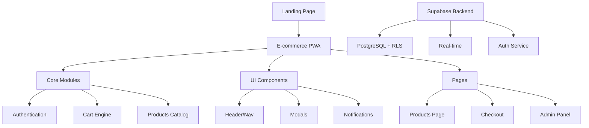
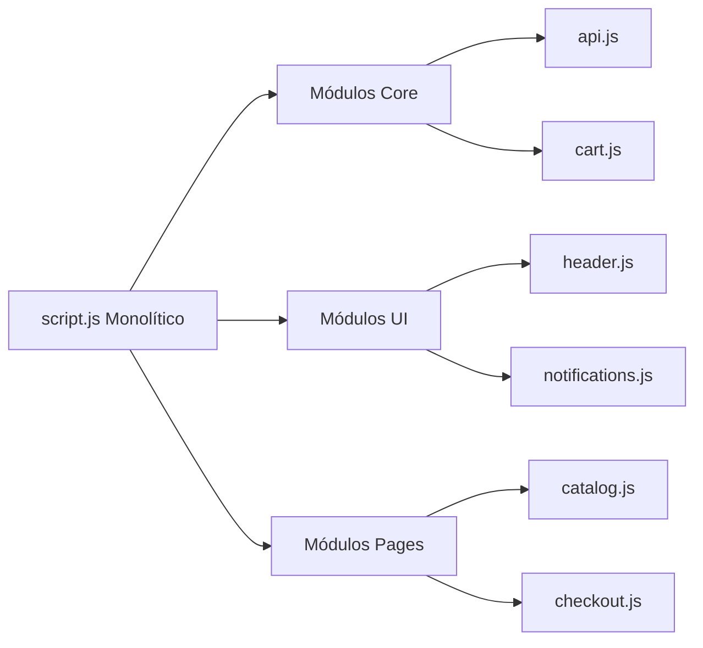

# 🥩 Carnicería El Señor de La Misericordia - E-commerce PWA

### Arquitectura Modular Mobile First con Supabase

[](https://developer.mozilla.org/en-US/docs/Web/Progressive_web_apps)
[]()
[](https://getbootstrap.com/)
[](https://owasp.org/www-project-top-ten/)
[](https://supabase.com/)

## 📋 Tabla de Contenidos

- [🚀 Características Clave](#-características-clave)
- [🏗️ Arquitectura del Proyecto](#️-arquitectura-del-proyecto)
- [🛠️ Tecnologías Utilizadas](#️-tecnologías-utilizadas)
- [📁 Estructura Modular Completa](#-estructura-modular-completa)
- [🔒 Seguridad y Estándares](#-seguridad-y-estándares)
- [⚙️ Configuración y Desarrollo](#️-configuración-y-desarrollo)
- [🎯 Flujos de Trabajo](#-flujos-de-trabajo)

## 🚀 Características Clave

<div align="center">

| Funcionalidad            | Estado            | Módulos Principales             |
| ------------------------ | ----------------- | ------------------------------- |
| **PWA Offline**          | ✅ Implementado   | `service_worker.js`             |
| **Catálogo Interactivo** | 🔄 Refactorizando | `catalog.js`, `productos.js`    |
| **Carrito Avanzado**     | 🔄 Migrando       | `cart.js`, `_modals.scss`       |
| **Autenticación Segura** | ✅ Activo         | `auth.js`, Supabase RLS         |
| **Fidelización**         | 🚧 En Desarrollo  | `loyalty.js`, `premium.html`    |
| **Mobile First**         | 🎯 Prioritario    | `_sidebar.scss`, `_header.scss` |

</div>

## 🏗️ Arquitectura del Proyecto



## 🛠️ Tecnologías Utilizadas

### 🔧 Stack Principal

| Capa            | Tecnología                | Propósito                        |
| --------------- | ------------------------- | -------------------------------- |
| **Frontend**    | JavaScript Vanilla + SCSS | Rendimiento y control total      |
| **Estilos**     | Bootstrap 5 + BEM         | Sistema de diseño consistente    |
| **Backend**     | Supabase (PostgreSQL)     | BaaS con autenticación integrada |
| **Build Tools** | Vite + Workbox            | Desarrollo rápido y PWA          |
| **Deployment**  | Static Hosting            | Netlify/Vercel/ GitHub Pages     |

### 📦 Dependencias Clave

```json
{
  "dependencies": {
    "axios": "HTTP client para APIs",
    "workbox": "Service Worker y caching",
    "chart.js": "Dashboard y analytics"
  },
  "devDependencies": {
    "vite": "Bundler y dev server",
    "sass": "Preprocesador CSS"
  }
}
```

## 📁 Estructura Modular Completa

```
LANDINGPAGES-CARNI.PWA/
├── 🎯 Páginas Principales
│   ├── index.html              # 🏠 Landing Page
│   ├── products.html           # 🛍️ E-commerce (Vista Principal)
│   ├── login.html              # 🔐 Autenticación
│   ├── register.html           # 📝 Registro Usuarios
│   ├── premium.html            # ⭐ Área Fidelización (BAC)
│   ├── offline.html            # 📲 Página Offline
│   └── admin/
│       └── dashboard.html      # 👨‍💼 Panel Administración
│
├── ⚙️ Núcleo de Aplicación (js/)
│   ├── app.js                  # 🚀 Punto de Entrada Principal
│   └── modules/
│       ├── 🧠 core/            # Lógica de Negocio
│       │   ├── api.js          # 🔌 Comunicación Supabase
│       │   ├── auth.js         # 🔒 Autenticación & OTP
│       │   ├── cart.js         # 🛒 Motor del Carrito
│       │   ├── productos.js    # 📦 Gestión Catálogo
│       │   ├── loyalty.js      # 💎 Programa Fidelización
│       │   ├── search.js       # 🔍 Búsqueda Avanzada
│       │   └── delivery.js     # 🚚 Lógica de Delivery
│       │
│       ├── 🌐 pages/           # Lógica por Vista
│       │   ├── catalog.js      # products.html
│       │   ├── checkout.js     # 🧾 Validaciones Pedido
│       │   ├── admin.js        # 👨‍💼 Panel Administración
│       │   ├── dashboard.js    # 📊 Dashboard Usuario
│       │   └── premium.js      # ⭐ Página Premium
│       │
│       ├── 🎨 ui/              # Componentes Interfaz
│       │   ├── header.js       # 🧭 Navegación Principal
│       │   ├── notifications.js # 💬 Sistema Alertas
│       │   ├── weather.js      # 🌤️ Integración Clima
│       │   └── ui-utils.js     # 🛠️ Utilidades UI
│       │
│       └── 🛠️ utils/           # Utilidades
│           ├── dom-utils.js    # 🎯 Manipulación DOM
│           ├── service_worker.js # 📲 PWA Offline
│           ├── offline.js      # 🔌 Lógica Offline
│           ├── admin-auth.js   # 🔐 Autenticación Admin
│           └── base_dinamica.js # 🏗️ Base Dinámica
│
├── 🎨 Sistema de Diseño SCSS (scss/)
│   ├── main.scss               # 🎛️ Archivo Maestro
│   │
│   ├── abstracts/              # 🛠️ Herramientas
│   │   ├── _variables.scss     # 🎨 Colores & Tipografía
│   │   ├── _mixins.scss        # 🔄 Funciones Reutilizables
│   │   ├── _bem-utilities.scss # 📐 Mixins BEM
│   │   ├── _functions.scss     # 🧮 Funciones SCSS
│   │   └── _placeholders.scss  # 🏷️ Placeholders
│   │
│   ├── base/                   # 🏗️ Fundamentos
│   │   ├── _reset.scss         # 🧹 Normalize CSS
│   │   ├── _typography.scss    # 🔤 Sistema Tipográfico
│   │   ├── _utilities.scss     # ⚡ Clases Helper
│   │   └── _base.scss          # 🎯 Estilos Base
│   │
│   ├── components/             # 🧩 Componentes UI
│   │   ├── _buttons.scss       # 🔘 Sistema de Botones
│   │   ├── _cards.scss         # 🃏 Tarjetas Producto
│   │   ├── _modals.scss        # 💬 Modales & Off-Canvas
│   │   ├── _alerts.scss        # ⚠️ Alertas & Notificaciones
│   │   ├── _badges.scss        # 🏷️ Badges & Etiquetas
│   │   ├── _carousel.scss      # 🖼️ Carruseles
│   │   └── _loading.scss       # ⏳ Indicadores Carga
│   │
│   ├── pages/                  # 📄 Estilos Específicos
│   │   ├── _home.scss          # 🏠 Landing Page
│   │   ├── _catalog.scss       # 🛍️ Catálogo Productos
│   │   ├── _cart.scss          # 🛒 Página Carrito
│   │   ├── _login.scss         # 🔐 Autenticación
│   │   ├── _admin.scss         # 👨‍💼 Panel Admin
│   │   ├── _products.scss      # 📦 Detalles Producto
│   │   └── _dashboard.scss     # 📊 Dashboard
│   │
│   ├── themes/                 # 🎭 Temas
│   │   ├── _theme.scss         # 🎨 Tema Principal
│   │   └── _dark-mode.scss     # 🌙 Tema Oscuro
│   │
│   └── vendors/                # 📚 Librerías Externas
│       ├── _bootstrap.scss     # 🎀 Overrides Bootstrap
│       └── _custom-vendors.scss # 🔧 Personalización
│
├── 📦 Build y Distribución
│   ├── dist/                   # 🏗️ Build de Producción
│   │   ├── assets/
│   │   │   ├── index-*.js      # 🔨 JS Compilado
│   │   │   ├── index-*.css     # 🎨 CSS Compilado
│   │   │   └── *.png           # 🖼️ Imágenes de Productos
│   │   └── index.html          # 📄 Página Principal Compilada
│   │
│   ├── css/                    # 🎨 CSS Compilado (NO TOCAR)
│   │   ├── main.css            # 🎨 CSS Final Compilado
│   │   └── main.css.map        # 🗺️ Source Maps para Debugging
│   │
│   └── package.json            # 📋 Dependencias & Scripts
│
├── 🖼️ Recursos Multimedia
│   └── img/                    # 🖼️ Imágenes en Desarrollo
│       ├── carrusel_products/  # 🖼️ Imágenes del Carrusel
│       ├── products/           # 🖼️ Imágenes de Productos
│       └── logo-user.png       # 👤 Avatar Usuario
│
├── 🔧 Configuración
│   ├── manifest.json           # 📱 Config PWA
│   ├── netlfly.toml           # 🚀 Config Despliegue Netlify
│   ├── package.json           # 📦 Dependencias
│   ├── postcss.config.js      # 🔧 PostCSS
│   ├── tailwind.config.js     # 🎨 Tailwind
│   ├── tsconfig.json          # 📝 TypeScript
│   └── .env.example           # 🗝️ Variables Entorno
│
└── 🗃️ Archivos No Modificables
    ├── node_modules/          # 📚 Dependencias (NO TOCAR)
    ├── css/main.css          # 🎨 CSS Compilado (NO TOCAR)
    ├── css/main.css.map      # 🗺️ Source Maps (NO TOCAR)
    └── dist/                 # 🏗️ Build Producción (NO TOCAR)
```

## 🔒 Seguridad y Estándares

### 🛡️ Validaciones Críticas OWASP

```javascript
// Validación de inputs críticos - checkout.js
const securityValidations = {
  nombre: {
    pattern: /^[A-Za-záéíóúñÁÉÍÓÚÑ\s]+$/,
    message: "Solo se permiten letras y espacios",
  },
  telefono: {
    pattern: /^\d{10}$/,
    message: "Debe contener exactamente 10 dígitos",
  },
  direccion: {
    validator: (value) => /\d/.test(value),
    message: "Debe contener al menos un número",
  },
};
```

### 📐 Metodología BEM Obligatoria

```scss
// Ejemplo de componente BEM - _cards.scss
.producto-card {
  &__image {
    /* Bloque */
  }
  &__title {
    /* Elemento */
  }
  &__price {
    &--discount {
      /* Modificador */
    }
  }
}
```

### 📖 Documentación JSDoc

```javascript
/**
 * @module cart
 * @description Motor principal de gestión del carrito de compras
 * @param {Object} product - Producto a agregar
 * @param {number} quantity - Cantidad personalizada
 * @returns {Promise<Object>} Estado actualizado del carrito
 * @throws {Error} Si el producto no tiene stock disponible
 */
export function addToCart(product, quantity) {
  // Implementación...
}
```

## ⚙️ Configuración y Desarrollo

### 🚀 Inicio Rápido

```bash
# 1. Clonar y configurar
git clone [repository-url]
cd LANDINGPAGES-CARNI.PWA

# 2. Instalar dependencias
npm install

# 3. Configurar entorno
cp .env.example .env
# Configurar variables de Supabase en .env

# 4. Ejecutar en desarrollo
npm run dev

# 5. Compilar para producción
npm run build
```

### 📜 Scripts Disponibles

| Comando              | Descripción              | Uso            |
| -------------------- | ------------------------ | -------------- |
| `npm run dev`        | Servidor desarrollo Vite | Desarrollo     |
| `npm run build`      | Build producción         | Deployment     |
| `npm run preview`    | Vista previa build       | Testing        |
| `npm run scss:watch` | Compilación SCSS en vivo | Desarrollo CSS |

### 🔗 Configuración Supabase

```sql
-- supabase-setup.sql
-- Configuración inicial de tablas y RLS
CREATE TABLE products (
  id UUID DEFAULT gen_random_uuid() PRIMARY KEY,
  name VARCHAR(255) NOT NULL,
  category VARCHAR(100),
  price DECIMAL(10,2),
  stock INTEGER
);

-- Habilitar Row Level Security
ALTER TABLE products ENABLE ROW LEVEL SECURITY;
```

## 🎯 Flujos de Trabajo

### 🔄 Migración de Código Legado



### 📱 Mobile First Implementation

```scss
// _variables.scss - Breakpoints Mobile First
$breakpoints: (
  mobile: 320px,
  tablet: 768px,
  desktop: 1024px,
  large: 1200px,
);

// Uso en componentes
@include respond-to(tablet) {
  .producto-card {
    grid-template-columns: repeat(2, 1fr);
  }
}
```

### 🧪 Desarrollo Guiado por Pruebas (TDD)

```gherkin
# Ejemplo criterio aceptación Gherkin
Feature: Personalización de cortes de carne
  Como cliente de la carnicería
  Quiero personalizar el grosor del corte
  Para obtener el producto exacto que necesito

  Scenario: Cliente selecciona grosor personalizado
    Given que estoy en la página de un producto cárnico
    When selecciono la opción "Personalizar grosor"
    And ajusto el slider a 2.5 cm
    Then el precio debe actualizarse reflejando el cambio
    And el carrito debe mostrar el grosor seleccionado
```

---

## 👨‍💻 Equipo de Desarrollo

**Arquitecto Principal**: pipeTawns-x  
**Metodología**: Mobile First + Security by Design  
**Stack**: JavaScript Vanilla + SCSS + Supabase  
**Estado**: 🔄 **Migración Activa** a Arquitectura Modular

---

<div align="center">

### 📞 ¿Preguntas o Contribuciones?

¡Nos encanta recibir feedback! Abre un **issue** o envía un **pull request** para mejorar esta PWA.

[📚 Documentación Técnica](docs/) • [🐛 Reportar Bug](issues/) • [💡 Sugerir Feature](issues/)

</div>

---

## 📝 Notas de Implementación

### ✅ Archivos Existentes y Estado

| Archivo             | Estado    | Ubicación Actual             | Ubicación Objetivo                   |
| ------------------- | --------- | ---------------------------- | ------------------------------------ |
| `main.css`          | ✅ Existe | `css/main.css`               | NO TOCAR - Compilado                 |
| `main.css.map`      | ✅ Existe | `css/main.css.map`           | NO TOCAR - Source Maps               |
| `service-worker.js` | ✅ Existe | `js/utils/service-worker.js` | `js/modules/utils/service_worker.js` |
| `admin-auth.js`     | ✅ Existe | `js/utils/admin-auth.js`     | `js/modules/utils/admin-auth.js`     |
| `base_dinamica.js`  | ✅ Existe | `js/utils/base_dinamica.js`  | `js/modules/utils/base_dinamica.js`  |

### 🔄 Archivos por Migrar

Los siguientes archivos requieren migración a la estructura modular:

- `js/utils/` → `js/modules/utils/`
- Lógica de `script.js` → Módulos core/pages correspondientes
- Refactorización de estilos a SCSS modular

### 🚫 Archivos No Modificables

- `node_modules/` - Dependencias del sistema
- `css/main.css` - Archivo compilado (modificar solo SCSS)
- `css/main.css.map` - Source maps generados
- `dist/` - Build de producción generado automáticamente
