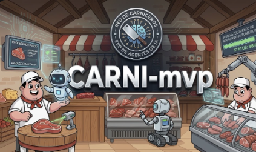

# Carni-mvp — MVP Frontend + Arquitectura Objetivo



> MVP frontend para Carnicería El Señor de La Misericordia. El repositorio ya contiene landing, catálogo, auth, carrito, dashboard base y PWA; además documenta la arquitectura objetivo para evolucionar hacia una plataforma comercial completa con datos, automatización e IA sin vender como implementado lo que todavía es roadmap.

[](https://github.com/pipeTawns-x/Landingpages-Carni.pwa)
[](https://github.com/pipeTawns-x/Landingpages-Carni.pwa)
[](manifest.json)
[](https://github.com/pipeTawns-x/Landingpages-Carni.pwa)
[](https://github.com/pipeTawns-x/Landingpages-Carni.pwa/tree/main)

---

## Estado Real del Proyecto

### Resumen ejecutivo

- **Existe hoy**: frontend navegable con landing, catálogo, auth, carrito, PWA y dashboard admin base con rutas corregidas a la raíz.
- **Existe hoy para EBAC Phase 1**: script Node.js en raíz con `CommonJS`, `axios`, `dotenv` y `chalk`, separado del frontend.
- **Existe parcialmente**: integración Supabase stub y placeholders admin.
- **Todavía no existe dentro del repo**: dashboard cliente real, flujos n8n, campañas Meta Ads activas, RLS productiva y automatizaciones operativas.

### Qué funciona hoy

| Módulo                              | Estado       | Detalle                                                                                                                    |
| ----------------------------------- | ------------ | -------------------------------------------------------------------------------------------------------------------------- |
| **Landing page**                    | ✅ Funcional | Navegación principal, hero y secciones comerciales                                                                         |
| **Catálogo webcommerce**            | ✅ Funcional | Cards por categoría, filtros y render dinámico                                                                             |
| **Carrito de compras**              | ✅ Funcional | `localStorage`, modal lateral, delivery o pickup y salida a WhatsApp                                                       |
| **Auth (Login/Registro)**           | ✅ Funcional | Sliding panel, validaciones frontend y redirecciones corregidas                                                            |
| **PWA + Offline**                   | ✅ Funcional | `manifest.json`, service worker y `offline.html`                                                                           |
| **Dashboard admin**                 | 🟡 Base      | Vista principal y páginas placeholder para productos, clientes y pedidos                                                   |
| **Dashboard cliente**               | 🔲 Pendiente | Sin perfil operativo, score ni historial real                                                                              |
| **Programa de afiliados**           | 🔲 Pendiente | No implementado aún en UI ni backend                                                                                       |
| **Supabase**                        | 🟡 Parcial   | Cliente configurado, sin modelo de datos vivo ni RLS real                                                                  |
| **n8n**                             | 🔲 Pendiente | Sin workflows versionados en este repo                                                                                     |
| **Infraestructura contenedorizada** | 🟡 Base      | `.devcontainer/` contiene `Dockerfile`, `devcontainer.json` y `docker-compose.yml` para trabajar npm dentro del contenedor |

### Estructura real del repositorio

```text
Carni-mvp/
├── .devcontainer/
│   ├── Dockerfile
│   ├── devcontainer.json
│   └── docker-compose.yml
├── .env
├── README.md
├── index.html
├── products.html
├── accessweb.html
├── dashboar.html
├── admin-products.html
├── admin-customers.html
├── admin-orders.html
├── offline.html
├── css/
├── js/
│   └── modules/
├── img/
│   ├── carrusel_products/
│   ├── products/
│   └── recursos_web/
├── docs/
│   ├── IMPLEMENTATION_PLAN.md
│   └── TASK_PLAN.md
├── agents/
│   ├── AGENTS.md
│   └── STITCH_REDESIGN_PROMPT.md
├── manifest.json
├── netlify.toml
├── package.json
└── vite.config.js
```

### Aclaracion documental

Este repo mantiene una capa local minima en `AGENTS.md` y `agents/AGENTS.md` para versionar reglas del producto, sin duplicar la plataforma global del usuario.
`docs/` queda reservado para planes versionados del proyecto.

---

## Visión del Producto

Carni-mvp busca transformar una carnicería tradicional en una plataforma digital completa: catálogo, carrito, auth, perfiles, dashboard operativo, automatización comercial e inteligencia aplicada a ventas y retención.

### Dirección estratégica consolidada

- **Frontend first, backend safe**: primero estabilizar y elevar el MVP actual sin romper rutas, IDs ni flujos existentes.
- **Marca, no solo catálogo**: la web debe comunicar identidad, confianza y experiencia premium local.
- **Centro operativo**: el dashboard admin debe evolucionar hacia ventas, promociones, campañas, tickets, analytics y consultas tipo RAG.
- **Relación continua con cliente**: afiliados, score, recompensas, historial y segmentación.
- **Colaboración IA 2026**: Stitch para exploración visual, Claude/Copilot/OpenCode para aterrizar implementación y revisión humana obligatoria antes de cambios de impacto.

### Prioridad actual

1. Consolidar el frontend existente y corregir deuda visual, responsive y de consistencia.
2. Rediseñar la experiencia comercial sin romper la base funcional actual.
3. Preparar la transición ordenada hacia Supabase, n8n y dashboards realmente operativos.

### Plataforma objetivo en 4 pilares

**1. Landing + Webcommerce**

- identidad visual de marca
- catálogo por categorías con carrito funcional
- checkout ligero con delivery o pickup
- pedido por WhatsApp
- PWA instalable con soporte offline

**2. Perfiles + Afiliados**

- login y registro conectados a auth real
- historial de compras y score del cliente
- programa de fidelización y referidos
- beneficios y campañas segmentadas

**3. Dashboard Administrativo**

| Ventana           | Objetivo                                           |
| ----------------- | -------------------------------------------------- |
| **Overview**      | Resumen de ventas, pedidos, clientes y puntos      |
| **Analytics**     | Gráficas, exportables y lectura rápida del negocio |
| **Productos**     | CRUD, stock, precios, imágenes y categorías        |
| **Pedidos**       | Validación, seguimiento y ticketing interno        |
| **Clientes**      | Historial, segmentación y score                    |
| **Promos**        | Cupones, descuentos, bundles y vigencias           |
| **Campañas**      | Operación de Meta Ads y difusión en canales        |
| **Bots**          | Seguimiento a conversaciones y pedidos entrantes   |
| **RAG / Chat IA** | Consultas operativas sobre datos del negocio       |
| **Configuración** | Datos del negocio, horarios, zonas y pagos         |

**4. Integraciones**

| Canal            | Uso objetivo                                           |
| ---------------- | ------------------------------------------------------ |
| **WhatsApp**     | Ventas, difusión y recordatorios                       |
| **Telegram**     | Tickets internos y canal operativo                     |
| **Meta Ads API** | Campañas creadas desde el dashboard                    |
| **Supabase**     | Auth, DB, storage, roles, score y auditoría            |
| **n8n**          | Workflows de pedidos, stock, campañas y notificaciones |

---

## Stack Tecnológico

### Frontend actual

| Tecnología                  | Uso                                                                  |
| --------------------------- | -------------------------------------------------------------------- |
| **Vanilla JS (ES modules)** | Lógica modular del MVP                                               |
| **SCSS 7-1 Pattern**        | Organización de estilos por dominio                                  |
| **Bootstrap 5.3.7**         | Base visual y layout                                                 |
| **PWA APIs**                | Manifest, cache offline y experiencia instalable                     |
| **Vite**                    | Tooling del proyecto, pendiente de uso canónico dentro de contenedor |

### Rediseño objetivo

| Tecnología              | Rol esperado                                            |
| ----------------------- | ------------------------------------------------------- |
| **Astro 5.x**           | Refactor progresivo a frontend más limpio y performante |
| **Tailwind CSS**        | Sistema utility-first para rediseño y dashboard         |
| **Alpine.js**           | Reactividad ligera para estados y ventanas              |
| **Chart.js**            | Métricas del dashboard                                  |
| **AOS / motion assets** | Animación intencional, no decorativa                    |

### Backend objetivo

| Tecnología                | Rol esperado                              |
| ------------------------- | ----------------------------------------- |
| **Supabase**              | Auth, PostgreSQL, Storage, Realtime y RLS |
| **n8n**                   | Orquestación operativa                    |
| **Meta Ads API**          | Publicación y control de campañas         |
| **Telegram Bot API**      | Tickets internos                          |
| **WhatsApp Business API** | Conversión, soporte y difusión            |

### Capa agentic y contexto

| Archivo o área                       | Estado             | Uso real hoy                                                                |
| ------------------------------------ | ------------------ | --------------------------------------------------------------------------- |
| **AGENTS.md**                        | ✅                 | Punto de entrada local para herramientas y agentes                          |
| **agents/AGENTS.md**                 | ✅                 | Guardrails locales del producto y del human-in-the-loop                     |
| **agents/STITCH_REDESIGN_PROMPT.md** | ✅                 | Referencia visual puntual para tareas de rediseño                           |
| **docs/TASK_PLAN.md**                | ✅                 | Estado de trabajo y prioridades vigentes                                    |
| **docs/IMPLEMENTATION_PLAN.md**      | ✅                 | Base de implementación y decisiones del repo                                |
| **Memoria persistente / MCP / GGA**  | 🟡 Externo al repo | Parte del stack-ia/gentle-ai del usuario, no infraestructura local del repo |

---

## Estándar 2026 de Trabajo con IA

Este repo se apoya en el stack-ia/gentle-ai base del usuario. El repositorio evita duplicar instrucciones, skills o reglas locales que puedan entrar en conflicto con esa base, pero si versiona reglas propias del producto para colaboradores.

### Cómo se trabaja con IA aquí

- **Human-in-the-loop obligatorio**: la IA propone o acelera; el humano valida dirección visual, seguridad y decisiones de alcance.
- **Spec-Driven Development**: explorar, proponer, especificar, diseñar, partir en tareas, aplicar y verificar.
- **Orquestación por roles**: el orquestador global del stack-ia sigue siendo la capa activa; la capa local solo agrega restricciones del producto.
- **Memoria y continuidad**: decisiones importantes deben persistirse en el stack del usuario, no como promesas falsas dentro del repo.
- **No destruir la base actual**: el rediseño debe mejorar el MVP existente, no reemplazarlo ignorando rutas, IDs, assets o flujos ya conectados.
- **Capa local complementaria**: el repo puede versionar reglas propias del producto y del flujo del equipo, siempre que no replique la plataforma global ni compita con ella.

### Decisiones de rediseño activas

- la estética objetivo no es neutra; debe sentirse intencional, comercial y memorable
- el enfoque preferido es **maximalismo mexicano equilibrado**
- catálogo y categorías pueden evolucionar hacia un **bento grid** sin perder claridad comercial
- el dashboard debe parecer centro operativo, no solo tabla genérica con Bootstrap
- la migración a Astro, Tailwind o Alpine es **objetivo de rediseño**, no estado actual del repo

### Criterio documental

- Si algo corre hoy en el repo, se documenta como **actual**.
- Si algo vive en prompts, exploración o roadmap, se documenta como **objetivo**.
- Si depende de Supabase productivo, n8n operativo o MCP externos no configurados en este repo, no se presenta como resuelto.

---

## Arquitectura

### Screaming Architecture

```text
/                       → vistas principales del negocio
js/modules/core/        → auth, cart, productos, delivery, loyalty
js/modules/pages/       → controladores por vista
js/modules/ui/          → header, notificaciones, búsqueda
js/modules/utils/       → utilidades, offline, service worker, auth admin
css/pages/              → estilos por dominio de pantalla
css/components/         → estilos reutilizables
```

### Patrones aplicados hoy

- **SCSS 7-1 Pattern**
- **BEM** en la UI existente
- **Mobile-first**: 320px → 768px → 1024px+
- **ES modules** en JavaScript
- **IIFE** para el carrito
- **localStorage** para persistencia liviana
- **Cache-first** en la PWA

### Alcance técnico inmediato

1. Consolidar frontend existente y corregir deuda visual o de UX.
2. Montar auth y datos reales en Supabase.
3. Levantar dashboard admin funcional.
4. Incorporar n8n y automatización de pedidos.
5. Extender a dashboard cliente, score y campañas con IA.

---

## Reglas de Trabajo

### Reglas para desarrollo humano

- Mantener las rutas HTML principales en raiz.
- No romper estilos, assets ni referencias al reorganizar estructura.
- Ejecutar Node/Vite dentro de `.devcontainer/`.
- Mantener secretos fuera del codigo y de la documentacion.
- Documentar de forma veraz el estado real del producto.

### Reglas para desarrollo humano + IA

- Human-in-the-loop obligatorio en cambios estructurales, borrados, renombres y cambios de integracion.
- La IA puede ayudar a explorar, proponer, implementar y documentar, pero no debe asumir autorizacion para limpieza agresiva.
- Las reglas globales del usuario viven en `stack-ia` / `gentle-ai`; las reglas locales del repo viven en `AGENTS.md` y `agents/`.
- Si una regla local y una global chocan, prevalece la global y la local debe ajustarse.

### Dónde viven las reglas

- `README.md`: reglas visibles para desarrolladores, colaboradores y compradores tecnicos del proyecto.
- `AGENTS.md`: punto de entrada para herramientas de IA.
- `agents/AGENTS.md`: restricciones locales especificas de Carni-mvp.
- `docs/TASK_PLAN.md` y `docs/IMPLEMENTATION_PLAN.md`: estado y base de implementacion del repo.
- `agents/STITCH_REDESIGN_PROMPT.md`: referencia visual para trabajo de rediseño.

---

## Guía de Estilos

### Dirección visual actual y target

| Color           | Hex       | Uso                             |
| --------------- | --------- | ------------------------------- |
| Rojo carnicería | `#d9534f` | CTAs y foco comercial           |
| Rojo vibrante   | `#DC2626` | Rediseño premium                |
| Oro acento      | `#F59E0B` | Hover y highlights              |
| Beige cálido    | `#E4D1B0` | Fondos secundarios              |
| Marrón oscuro   | `#363432` | Footer, sidebar y contraste     |
| Blanco          | `#FFFFFF` | Superficie y texto sobre oscuro |

### Principios visuales

- tipografía con personalidad y jerarquía clara
- composición fuerte: hero potente, categorías memorables y cards con intención
- animación sobria: revelar, desplazar y destacar sin saturar
- dashboard con presencia visual real, no apariencia genérica

### Breakpoints de referencia

| Breakpoint | Uso                        |
| ---------- | -------------------------- |
| `320px`    | móvil pequeño              |
| `570px`    | móvil grande               |
| `768px`    | tablet                     |
| `870px`    | tablet grande / auth split |
| `1024px+`  | desktop                    |

---

## Inicio Rápido

### Modo actual del repo

Este proyecto hoy es un frontend estático con tooling Node definido para ejecutarse **dentro del contenedor**. La regla de trabajo para este repo es clara: **no usar `npm` localmente en macOS como flujo canonico**. `npm`, Vite y el servidor local viven en `.devcontainer/`, incluyendo su `docker-compose.yml`.

### Navegación actual

| Pantalla        | Ruta                    |
| --------------- | ----------------------- |
| Landing         | `/index.html`           |
| Catálogo        | `/products.html`        |
| Auth            | `/accessweb.html`       |
| Dashboard admin | `/dashboar.html`        |
| Admin productos | `/admin-products.html`  |
| Admin clientes  | `/admin-customers.html` |
| Admin pedidos   | `/admin-orders.html`    |
| Offline         | `/offline.html`         |

### Flujo de trabajo con contenedor

1. abrir el repo en el devcontainer
2. ejecutar `npm install` dentro del contenedor
3. usar `npm run dev` para Vite o `npm run serve:static` para servir el root actual
4. mantener el host limpio de tooling Node operativo para este repo

### Variables de entorno

- `.env`: contrato local unico del proyecto para variables de entorno dentro del contenedor
- no se versionan archivos espejo de ejemplo para evitar drift documental y basura de soporte

---

## EBAC Node.js Phase 1

### Qué agrega esta práctica al repo

La práctica EBAC se implementa como una **capa Node.js aislada** sobre Carni-mvp, sin tocar los entrypoints HTML ni la lógica del frontend. El runtime comercial actual sigue siendo la PWA con Vite; la práctica agrega un script de consola en la raíz para demostrar fundamentos de Node.js con `CommonJS`, `dotenv` y `axios`.

### Fundamentos Node.js en el contexto de Carni-mvp

- **Runtime separado del navegador**: `app.js` corre con Node y no entra al bundle de Vite.
- **Módulos CommonJS**: la práctica usa `require()` porque EBAC Phase 1 pide una base simple y explícita.
- **I/O HTTP controlado**: `axios` hace un `GET` a una API pública relevante al negocio.
- **Configuración por entorno**: `dotenv` lee `.env`, que ya es el contrato único del repo.
- **Sin romper la PWA**: `npm run ebac` vive en paralelo a `npm run dev` y `npm run build`.

### API pública elegida para la ejecución verificable

La práctica ejecutable usa **Open-Meteo** porque encaja con Carni-mvp y permite verificación estable sin depender de claves privadas.

| API               | Relevancia para Carni-mvp                                             | Auth | Uso recomendado                          |
| ----------------- | --------------------------------------------------------------------- | ---- | ---------------------------------------- |
| **Open-Meteo**    | clima para delivery, operación diaria y alertas logísticas            | No   | práctica EBAC ejecutable con `axios GET` |
| **OpenFoodFacts** | enriquecimiento futuro de productos, categorías y datos nutricionales | No   | roadmap técnico para catálogo/admin      |
| **TheMealDB**     | contenido futuro de recetas, bundles y campañas comerciales           | No   | prototipos de marketing y contenido      |

### APIs investigadas desde publicapis.dev para evolución segura del proyecto

El catálogo de `publicapis.dev` aporta opciones que sí encajan con la carnicería y con una evolución realista del MVP sin romper la PWA actual.

| API           | Categoría    | Auth    | Uso propuesto en Carni-mvp                                            | Implementación segura                                                                                 |
| ------------- | ------------ | ------- | --------------------------------------------------------------------- | ----------------------------------------------------------------------------------------------------- |
| **Meteoblue** | Weather      | API Key | clima comercial para promos, planeación de delivery y widgets futuros | guardar key en `.env` como `VITE_METEOBLUE_KEY` para frontend o `METEOBLUE_KEY` para scripts Node/n8n |
| **IPWhois**   | Geocoding    | API Key | detectar ciudad, ISP y cobertura de delivery para SLP                 | usar desde Node/n8n con variable no `VITE_*`; no exponer la key al navegador                          |
| **LCBO**      | Food & Drink | API Key | maridaje de vinos o bebidas con cortes premium y bundles comerciales  | integrar primero en backend o automatización; no acoplar al catálogo hasta validar UX                 |
| **Sent.dm**   | Messaging    | API Key | difusión por WhatsApp y recordatorios operativos                      | consumir solo desde n8n o backend; nunca desde la PWA pública                                         |

### Cómo usar estas APIs sin romper el MVP

1. **Phase 1 EBAC**: mantener `app.js` con una API pública verificable y desacoplada del frontend.
2. **Phase 2 Producto**: llevar integraciones con key a backend ligero, n8n o Supabase Edge Functions.
3. **Phase 3 Comercial**: exponer solo datos derivados al frontend, nunca las credenciales ni respuestas sensibles completas.

### Patrón recomendado de integración

```text
publicapis.dev -> selección y contraste de APIs
Node.js app.js -> práctica EBAC verificable por consola
n8n / backend  -> llamadas autenticadas y automatización
Supabase       -> cache, auditoría, configuración y datos derivados
PWA frontend   -> solo consume resultados listos para UI
```

### Cómo se seleccionó la API

- **publicapis.dev** sirve como catálogo para filtrar APIs públicas por utilidad, auth y madurez.
- **Perplexity** es útil para contrastar rápidamente límites, casos de uso y señales de mantenimiento antes de integrar.
- **NotebookLM** sirve para condensar README, notas del sprint y entregables EBAC en una base de estudio o defensa técnica.

Ninguna de esas herramientas forma parte del runtime del proyecto. En este repo se documentan como apoyo de investigación, validación y aprendizaje agentic.

### Implementación segura con `.devcontainer/`, Docker y flujo agentic

1. Abrir Carni-mvp dentro del devcontainer cuando el flujo de trabajo sea el canónico del equipo.
2. Mantener `.env` como contrato único; no crear archivos espejo de entorno.
3. Usar variables no `VITE_*` para scripts Node futuros que no deban exponerse al navegador.
4. Preferir APIs sin auth para verificación inicial y dejar APIs con llave para capas posteriores del producto.
5. Mantener el script EBAC desacoplado del frontend para no introducir regresiones en la PWA.

### Variables de entorno usadas por la práctica

La práctica funciona sin configuración adicional, pero puede personalizarse en `.env` con estas claves opcionales:

```env
EBAC_CITY=Queretaro
EBAC_GEOCODE_URL=https://geocoding-api.open-meteo.com/v1/search
EBAC_WEATHER_URL=https://api.open-meteo.com/v1/forecast
```

Si no se definen, `app.js` usa valores por defecto seguros para poder verificar la entrega sin depender de secretos.

### Entregable EBAC y cómo este repo lo satisface

| Requisito EBAC Phase 1           | Cómo se cubre en Carni-mvp                                                        |
| -------------------------------- | --------------------------------------------------------------------------------- |
| Proyecto Node con `package.json` | ya existe y ahora incluye metadata y script `npm run ebac`                        |
| Uso de `require()`               | `app.js` usa CommonJS                                                             |
| Uso de `axios`                   | `app.js` hace `GET` a Open-Meteo                                                  |
| Uso de `dotenv`                  | `app.js` carga `.env` con `dotenv.config()`                                       |
| Salida entendible en consola     | `chalk` colorea la salida sin afectar el flujo del proyecto                       |
| Ejecución limpia                 | la práctica corre en paralelo al frontend y se valida también con `npm run build` |

### Comandos de validación

```bash
npm install
npm run ebac
npm run build
```

### Checklist de cumplimiento EBAC Phase 1

| Requisito                                 | Estado | Evidencia en el repo                                                         |
| ----------------------------------------- | ------ | ---------------------------------------------------------------------------- |
| Inicializar proyecto Node                 | ✅     | `package.json` en raíz                                                       |
| Modificar `name`, `author`, `description` | ✅     | metadata actualizada para la práctica                                        |
| Instalar `axios` y un paquete libre       | ✅     | `axios`, `dotenv`, `chalk`                                                   |
| Crear `app.js` con `require()`            | ✅     | `app.js` usa CommonJS                                                        |
| Hacer request a API externa               | ✅     | `app.js` consulta Open-Meteo                                                 |
| Imprimir respuesta en consola             | ✅     | salida con `chalk` y métricas legibles                                       |
| Entrega reproducible                      | ✅     | `package-lock.json` ya puede versionarse y regenerarse dentro del contenedor |

### Entrega recomendada para EBAC sin romper Carni-mvp

1. Abrir el repo en `.devcontainer/`.
2. Ejecutar `npm install` para generar `package-lock.json` reproducible.
3. Validar `npm run ebac`.
4. Validar `npm run build` para confirmar que la PWA no se rompió.
5. Entregar `app.js`, `package.json` y `package-lock.json` junto con este README actualizado como soporte técnico.

### Estado por capas

- **Existe hoy**: frontend/PWA/Vite, `.devcontainer/`, `.env` y el nuevo script Node de práctica.
- **Práctica EBAC**: `app.js`, dependencias Node mínimas y documentación de ejecución.
- **Roadmap**: integraciones reales con OpenFoodFacts, TheMealDB, Supabase productivo, n8n y automatización comercial.

### Arquitectura estable del repo

```text
app.js                   -> script Node.js para la práctica EBAC Phase 1
html raíz                -> entrypoints públicos y administrativos
css/                     -> estilos organizados en 7-1 pattern
js/modules/core/         -> auth, cart, delivery, productos, loyalty
js/modules/pages/        -> controladores por pantalla
js/modules/ui/           -> header y comportamiento compartido
js/modules/utils/        -> utilidades de soporte y PWA
js/modules/app.js        -> helpers globales del frontend
img/                     -> assets publicos en tres carpetas: carrusel, productos y recursos_web
docs/                    -> planes versionados del proyecto
agents/                  -> reglas locales y prompt visual del producto
.devcontainer/           -> Dockerfile, devcontainer y compose para Node/Vite
```

---

## Seguridad

### Protocolo mínimo

1. Secretos públicos del frontend solo en variables `VITE_*` dentro de `.env` o `.env.local`.
2. Secrets privados de integraciones futuras solo en variables no `VITE_*`, nunca consumidas desde el navegador.
3. Validación dual en inputs relevantes.
4. Sanitización anti-XSS en formularios.
5. RLS en Supabase cuando la base sea real.
6. Rate limiting en auth y pedidos cuando exista backend.
7. Nada de contraseñas en `localStorage`.

### Validación frontend actual

```javascript
const isValidEmail = (email) => /^[^\s@]+@[^\s@]+\.[^\s@]+$/.test(email);
const isValidPhone = (phone) => /^[0-9]{10}$/.test(phone);
const isValidPassword = (pass) => pass.length >= 8;
function sanitizeInput(str) {
  return str.replace(/[<>\"']/g, "").trim();
}
```

---

## Roadmap

### Sprint 0 — Profesionalización de la base

- [x] Crear `.devcontainer/`
- [x] Definir stack local reproducible con contenedores
- [x] Consolidar política de secrets con `.env`
- [x] Documentar setup real reproducible
- [x] Eliminar la sobrecapa local que duplicaba o podia confundir frente a stack-ia

### Sprint 1 — Rediseño frontend

- [ ] Landing con identidad más fuerte
- [ ] Catálogo con bento grid y cards premium
- [ ] Auth con mejor dirección visual
- [ ] Dashboard admin con layout más moderno
- [ ] Responsive fino de 320px a desktop
- [ ] Base para dashboard cliente

### Sprint 2 — Dashboard admin funcional

- [ ] Analytics con Chart.js
- [ ] CRUD de productos
- [ ] Pedidos con validación y ticket interno
- [ ] Promos y descuentos
- [ ] Campañas con flujo operativo real

### Sprint 3 — Backend e integraciones

- [ ] Supabase Auth real
- [ ] Tablas productivas
- [ ] Workflows n8n
- [ ] Canal WhatsApp / Telegram
- [ ] Score de cliente y auditoría

### Sprint 4 — Perfiles y afiliados

- [ ] Perfil de usuario
- [ ] Programa de afiliados
- [ ] Referidos
- [ ] Canales de difusión segmentados

### Sprint 5 — IA y marketing

- [ ] Meta Ads API real
- [ ] Consultas comerciales asistidas por IA
- [ ] Automatización predictiva
- [ ] Escalado a múltiples sucursales

---

## Contexto para Agentes y Colaboradores

### Reglas prácticas

1. No romper rutas raíz como `accessweb.html` o `dashboar.html`.
2. No mover archivos sin rastrear referencias HTML, JS, SCSS y service worker.
3. No crear CSS aislado fuera del patrón SCSS del proyecto.
4. No hardcodear colores o tamaños si ya existe una convención equivalente.
5. No vender como operativo algo que solo vive en prompts o roadmap.
6. Si llega el rediseño con Stitch, aterrizarlo respetando el dominio visual y técnico actual del repo.

### IDs HTML sensibles

| ID                | Archivo          | Función                   |
| ----------------- | ---------------- | ------------------------- |
| `authContainer`   | `accessweb.html` | contenedor auth principal |
| `btnShowRegister` | `accessweb.html` | toggle a registro         |
| `btnShowLogin`    | `accessweb.html` | toggle a login            |
| `loginForm`       | `accessweb.html` | formulario login          |
| `registerForm`    | `accessweb.html` | formulario registro       |

### Componentes clave actuales

**Carrito**

- `js/modules/core/cart.js`
- IIFE con persistencia en `localStorage`
- modal slide-in
- delivery o pickup
- salida a WhatsApp

**Auth**

- `js/modules/core/auth.js`
- `css/pages/_access.scss`
- sliding panel
- validación frontend

**Header**

- `js/modules/ui/header.js`
- `css/layout/_header.scss`
- logo, iconos, drawer y búsqueda

**Catálogo**

- `js/modules/pages/catalog.js`
- render dinámico por categoría
- cards, precio, peso y agregar

---

## Apéndice Técnico

### Flujo de autenticación esperado hoy

```text
Usuario -> /accessweb.html -> Supabase Auth (stub hoy)
                           -> cliente -> /index.html o /products.html
                           -> admin -> /dashboar.html
```

### Variables de entorno objetivo

```env
VITE_SUPABASE_URL=https://tu-proyecto.supabase.co
VITE_SUPABASE_ANON_KEY=tu-anon-key
VITE_WEATHER_API_KEY=tu-api-key-del-clima
VITE_WHATSAPP_PHONE=524442715470
VITE_TELEGRAM_BOT_NAME=Rogelio
SUPABASE_SERVICE_ROLE_KEY=tu-service-role-key
N8N_API_URL=http://localhost:5678
N8N_API_KEY=tu-api-key
META_ADS_ACCESS_TOKEN=meta-access-token
WHATSAPP_ACCESS_TOKEN=whatsapp-access-token
TELEGRAM_BOT_TOKEN=telegram-bot-token
```

### Prompting y rediseño

El repo conserva suficiente contexto para seguir explorando rediseño con Stitch y Claude, pero el criterio es este:

- usar prompts para descubrir dirección visual
- bajar resultados al repo respetando estructura real
- validar performance, accesibilidad y seguridad antes de consolidar
- separar claramente lo exploratorio de lo implementado

---

## Contribución

1. Mantener compatibilidad con la estructura real de `css/`, `js/`, archivos HTML raíz y PWA.
2. No documentar features como operativas si solo existen como diseño, prompt o roadmap.
3. Actualizar este README cuando cambie la arquitectura real.

## Licencia

MIT License.

---

## Contacto

- **Negocio**: Carnicería El Señor de La Misericordia
- **Ubicación**: San Luis Potosí, México
- **Teléfono**: +52 444 271 5470

---

**Branch activo**: `main`
**Última actualización**: Abril 2026
**Versión**: v3.2
