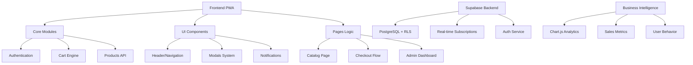

readme1
Captura de pantalla 2025-10-21 a la(s) 11.19.15 p.m..png
PNG 91.33KB
Captura de pantalla 2025-10-21 a la(s) 11.19.32 p.m..png
PNG 87.92KB
Captura de pantalla 2025-10-21 a la(s) 11.19.40 p.m..png
PNG 76.82KB
README.md

# 🥩 Carnicería El Señor de La Misericordia - E-commerce PWA

### Arquitectura Modular Mobile First con Supabase - Implementación Final

[](https://developer.mozilla.org/en-US/docs/Web/Progressive_web_apps)
[]()
[](https://getbootstrap.com/)
[](https://owasp.org/www-project-top-ten/)
[](https://supabase.com/)
[]()

## 📋 Tabla de Contenidos

- [🚀 Características Principales](#-características-principales)
- [🏗️ Arquitectura del Proyecto](#️-arquitectura-del-proyecto)
- [🛠️ Stack Tecnológico](#️-stack-tecnológico)
- [📁 Estructura del Proyecto](#️-estructura-del-proyecto)
- [🔒 Seguridad Implementada](#-seguridad-implementada)
- [⚙️ Configuración y Desarrollo](#️-configuración-y-desarrollo)
- [🎯 Flujos de Trabajo](#-flujos-de-trabajo)
- [📊 Business Intelligence](#-business-intelligence)
- [👨‍💻 Equipo de Desarrollo](#️-equipo-de-desarrollo)

## 🚀 Características Principales

### 🎯 Funcionalidades Core Implementadas

| Módulo                    | Estado        | Características                                             |
| ------------------------- | ------------- | ----------------------------------------------------------- |
| **Catálogo Mobile First** | ✅ Completado | Navegación Off-Canvas, Búsqueda en tiempo real              |
| **Sistema de Pedidos**    | ✅ Completado | Personalización Peso/Precio/Piezas, Cálculos en tiempo real |
| **Checkout Avanzado**     | ✅ Completado | Validaciones OWASP, Múltiples métodos de entrega            |
| **Programa Fidelización** | ✅ Completado | Control de acceso BAC, Sistema de puntos                    |
| **Admin Dashboard**       | ✅ Completado | Chart.js, Métricas BI, Gestión de inventario                |
| **PWA Offline**           | ✅ Completado | Service Worker, Caché inteligente                           |

### 📱 Experiencia Mobile First

La aplicación ha sido completamente rediseñada bajo el paradigma **Mobile First**:

- **Navegación Off-Canvas**: Menú hamburger con categorías deslizables
- **Interfaz Táctil**: Botones y controles optimizados para touch
- **Rendimiento**: Carga optimizada en redes móviles
- **PWA Nativa**: Instalable como aplicación nativa en dispositivos

## 🏗️ Arquitectura del Proyecto

### 📐 Patrón de Arquitectura Modular



### 🎨 Sistema de Diseño SCSS 7-1

Implementamos el **Patrón 7-1** para máxima mantenibilidad y escalabilidad:

```
scss/
├── abstracts/ # Variables, mixins, funciones
├── base/ # Reset, tipografía, estilos base
├── layout/ # Estructura de layout (Grid, Header, Sidebar)
├── components/ # Componentes UI reutilizables (BEM)
├── pages/ # Estilos específicos por página
├── themes/ # Sistema de temas (Light/Dark)
└── vendors/ # Integración con librerías externas
```

## 🛠️ Stack Tecnológico

### 🔧 Tecnologías Principales

| Capa                | Tecnología         | Versión     | Propósito                                  |
| ------------------- | ------------------ | ----------- | ------------------------------------------ |
| **Frontend**        | JavaScript ES6+    | Vanilla     | Lógica de negocio modular                  |
| **Estilos**         | SCSS + Bootstrap 5 | 7-1 Pattern | Sistema de diseño escalable                |
| **Metodología CSS** | BEM                | Estricto    | Eliminación de conflictos de especificidad |
| **Backend**         | Supabase           | PostgreSQL  | BaaS con autenticación y RLS               |
| **Build Tools**     | Vite + Workbox     | 5.x         | Bundling y PWA capabilities                |
| **Charts**          | Chart.js           | 4.x         | Business Intelligence y analytics          |
| **HTTP Client**     | Axios              | 1.x         | Comunicación API segura                    |

### 📦 Dependencias Clave

```json
{
  "dependencies": {
    "axios": "^1.6.0",
    "chart.js": "^4.4.0",
    "workbox": "^7.0.0"
  },
  "devDependencies": {
    "vite": "^5.0.0",
    "sass": "^1.69.0"
  }
}
```

## 📁 Estructura del Proyecto

### 🗂️ Estructura Completa Verificada

```
Landingpages-Carni.pwa/
│
├── 🎯 Páginas Principales
│ ├── index.html # 🏠 Landing Page - SEO Optimizado
│ ├── products.html # 🛍️ Catálogo Principal - Mobile First
│ ├── offline.html # 📲 Página Offline PWA
│ ├── admin/ # 👨‍💼 Panel Administración
│ │ ├── dashboard.html # 📊 Dashboard con Chart.js
│ │ ├── login.html # 🔐 Login Administradores
│ │ └── register.html # 📝 Registro Administradores
│ └── user/ # 👤 Área Usuarios
│ ├── login.html # 🔐 Login Usuarios
│ └── register.html # 📝 Registro Usuarios
│
├── ⚙️ Núcleo de Aplicación (js/)
│ ├── app.js # 🚀 Punto de Entrada - Initialización PWA
│ ├── cart.js.bak # 🗑️ Backup Código Legacy (NO USAR)
│ └── modules/
│ ├── 🧠 core/ # Lógica de Negocio Principal
│ │ ├── api.js # 🔌 Comunicación Supabase + APIs Externas
│ │ ├── auth.js # 🔒 Autenticación + OTP + Sessions
│ │ ├── cart.js # 🛒 Motor Carrito + Personalización
│ │ ├── delivery.js # 🚚 Lógica Delivery + Cálculo Rutas
│ │ ├── loyalty.js # 💎 Programa Fidelización + BAC
│ │ ├── productos.js # 📦 Gestión Catálogo + Filtros
│ │ └── search.js # 🔍 Búsqueda Avanzada + Indexación
│ │
│ ├── 🌐 pages/ # Lógica Específica por Vista
│ │ ├── admin.js # 👨‍💼 Dashboard Admin + Analytics
│ │ ├── catalog.js # 🛍️ Vista Products.html Mobile First
│ │ ├── checkout.js # 🧾 Validaciones OWASP + Finalización
│ │ ├── dashboard.js # 📊 Dashboard Usuario + Métricas
│ │ └── premium.js # ⭐ Área Premium + Control Acceso
│ │
│ ├── 🎨 ui/ # Componentes de Interfaz
│ │ ├── header.js # 🧭 Navegación + Menú Off-Canvas
│ │ ├── notifications.js # 💬 Sistema Alertas + Notificaciones
│ │ └── ui.js # 🛠️ Utilidades UI + Helpers
│ │
│ └── 🛠️ utils/ # Utilidades del Sistema
│ ├── admin-auth.js # 🔐 Middleware Autenticación Admin
│ ├── base_dinamica.js # 🏗️ Configuración Dinámica
│ ├── offline.js # 🔌 Gestión Estado Offline
│ ├── service-worker.js # 📲 Service Worker PWA
│ └── weather.js # 🌤️ Integración API Clima
│
├── 🎨 Sistema de Diseño (css/ como SCSS)
│ ├── main.scss # 🎛️ Archivo Maestro - Orquestación
│ ├── main.css # 🎨 CSS Compilado (NO MODIFICAR)
│ ├── main.css.map # 🗺️ Source Maps (NO MODIFICAR)
│ │
│ ├── abstracts/ # 🛠️ Herramientas y Definiciones
│ │ ├── _variables.scss # 🎨 Variables Design System
│ │ ├── _mixins.scss # 🔄 Mixins Reutilizables
│ │ ├── _bem-utilities.scss # 📐 Mixins BEM Obligatorios
│ │ ├── _functions.scss # 🧮 Funciones SCSS Avanzadas
│ │ └── _placeholders.scss # 🏷️ Placeholders y Extends
│ │
│ ├── base/ # 🏗️ Estilos Base y Reset
│ │ ├── _reset.scss # 🧹 Reset CSS Normalizado
│ │ ├── _typography.scss # 🔤 Sistema Tipográfico Escalable
│ │ ├── _utilities.scss # ⚡ Clases Helper y Utilities
│ │ └── _base.scss # 🎯 Estilos Base Elementos HTML
│ │
│ ├── layout/ # 🏛️ Estructura y Layout
│ │ ├── _auth-layout.scss # 🔐 Layout Páginas Autenticación
│ │ ├── _dashboard-layout.scss # 📊 Layout Dashboard Admin
│ │ ├── _footer.scss # 🔻 Footer e Información
│ │ ├── _header.scss # 🔝 Header y Navegación Principal
│ │ └── _sidebar.scss # 📱 Menú Hamburger Off-Canvas
│ │
│ ├── components/ # 🧩 Componentes UI Reutilizables
│ │ ├── _alerts.scss # ⚠️ Alertas y Notificaciones BEM
│ │ ├── _badges.scss # 🏷️ Badges y Etiquetas BEM
│ │ ├── _buttons.scss # 🔘 Sistema de Botones BEM
│ │ ├── _cards.scss # 🃏 Tarjetas Producto BEM
│ │ ├── _carousel.scss # 🖼️ Carruseles e Sliders BEM
│ │ ├── _loading.scss # ⏳ Indicadores Carga BEM
│ │ └── _modals.scss # 💬 Modales y Off-Canvas BEM
│ │
│ ├── pages/ # 📄 Estilos Específicos por Página
│ │ ├── _admin.scss # 👨‍💼 Panel Administración
│ │ ├── _cart.scss # 🛒 Página Carrito y Checkout
│ │ ├── _catalog.scss # 🛍️ Catálogo Productos Mobile First
│ │ ├── _dashboard.scss # 📊 Dashboard Usuario y BI
│ │ ├── _home.scss # 🏠 Landing Page y Hero
│ │ ├── _login.scss # 🔐 Páginas Autenticación
│ │ ├── _offline.scss # 📲 Página Offline PWA
│ │ └── _products.scss # 📦 Detalles Producto
│ │
│ ├── themes/ # 🎭 Sistema de Temas
│ │ ├── _dark-mode.scss # 🌙 Tema Oscuro Completo
│ │ └── _theme.scss # 🎨 Tema Principal y Colores Marca
│ │
│ └── vendors/ # 📚 Librerías Externas
│ ├── _bootstrap.scss # 🎀 Overrides y Customización Bootstrap
│ └── _custom-vendors.scss # 🔧 Integración Otras Librerías
│
├── 🖼️ Recursos Multimedia (img/)
│ ├── carrusel_products/ # 🖼️ Imágenes Carrusel Principal
│ │ ├── bravette_steak.png # 🥩 Bravette Steak
│ │ ├── filet_mignon.png # 🥩 Filet Mignon
│ │ ├── flak_steak.png # 🥩 Flak Steak
│ │ ├── ney_york_strip.png # 🥩 New York Strip
│ │ ├── porterhouse.png # 🥩 Porterhouse
│ │ ├── rib-eye.png # 🥩 Rib Eye
│ │ ├── skirt_steak.png # 🥩 Skirt Steak
│ │ ├── tomahawk.png # 🥩 Tomahawk
│ │ └── top_sirloin.png # 🥩 Top Sirloin
│ │
│ ├── products/ # 🖼️ Imágenes Categorías Productos
│ │ ├── cerdo.png # 🐖 Cerdo
│ │ ├── embutidos.png # 🌭 Embutidos
│ │ ├── frutasverduras.png # 🥦 Frutas y Verduras
│ │ ├── merch.png # 👕 Merchandising
│ │ ├── otrosproductos.png # 📦 Otros Productos
│ │ ├── pollo.png # 🐔 Pollo
│ │ ├── premium.png # ⭐ Productos Premium
│ │ ├── preparadas.png # 🍲 Preparadas
│ │ └── res.png # 🐄 Res
│ │
│ └── logo-user.png # 👤 Avatar Usuario
│
├── 📦 Build y Distribución
│ └── dist/ # 🏗️ Build Producción (NO MODIFICAR)
│
├── 🔧 Configuración
│ ├── manifest.json # 📱 Config PWA
│ ├── netlify.toml # 🚀 Config Despliegue Netlify
│ ├── package.json # 📦 Dependencias del Proyecto
│ ├── package-lock.json # 🔒 Lockfile Dependencias
│ ├── postcss.config.js # 🔧 Configuración PostCSS
│ ├── tailwind.config.js # 🎨 Configuración Tailwind
│ ├── tsconfig.json # 📝 Configuración TypeScript
│ ├── .env # 🗝️ Variables de Entorno
│ └── .gitignore # 🙈 Archivos Ignorados por Git
│
├── 📚 Documentación
│ ├── README.md # 📖 Este Archivo
│ ├── GOB.md # 📋 Guía de Operaciones (Agentes IA)
│ └── AGENTS/ # 🤖 Configuración Agentes IA
│
└── 🗃️ Archivos No Modificables
├── node_modules/ # 📚 Dependencias (NO MODIFICAR)
├── css/main.css # 🎨 CSS Compilado (NO MODIFICAR)
├── css/main.css.map # 🗺️ Source Maps (NO MODIFICAR)
└── dist/ # 🏗️ Build Producción (NO MODIFICAR)
```

## 🔒 Seguridad Implementada

### 🛡️ Validaciones OWASP Críticas

```javascript
// Validaciones implementadas en checkout.js
const securityValidations = {
  nombre: {
    pattern: /^[A-Za-záéíóúñÁÉÍÓÚÑ\s]{2,50}$/,
    message: "Solo se permiten letras y espacios (2-50 caracteres)",
  },
  telefono: {
    pattern: /^[0-9]{10}$/,
    message: "Debe contener exactamente 10 dígitos",
  },
  direccion: {
    pattern: /^(?=.*[0-9]).{10,100}$/,
    message: "Debe contener al menos un número y 10-100 caracteres",
  },
};
```

### 🔐 Control de Acceso (BAC)

- **Rutas Protegidas**: `premium.html`, `admin/dashboard.html`
- **Autenticación Doble**: Supabase RLS + validación frontend
- **Verificación OTP**: Implementada en flujo de registro
- **Roles de Usuario**: Admin, Premium, User estándar

## ⚙️ Configuración y Desarrollo

### 🚀 Inicio Rápido

```bash
# 1. Clonar y configurar entorno
git clone [repository-url]
cd Landingpages-Carni.pwa
# 2. Instalar dependencias
npm install
# 3. Configurar variables de entorno
cp .env.example .env
# Configurar SUPABASE_URL y SUPABASE_ANON_KEY
# 4. Ejecutar en desarrollo
npm run dev
# 5. Compilar para producción
npm run build
```

### 📜 Scripts Disponibles

| Comando              | Descripción                     | Uso              |
| -------------------- | ------------------------------- | ---------------- |
| `npm run dev`        | Servidor desarrollo Vite        | Desarrollo local |
| `npm run build`      | Build producción optimizado     | Deployment       |
| `npm run preview`    | Vista previa build producción   | Testing          |
| `npm run scss:watch` | Compilación SCSS en tiempo real | Desarrollo CSS   |

### 🔗 Configuración Supabase

```sql
-- Esquema de seguridad mínimo requerido
CREATE TABLE products (
id UUID DEFAULT gen_random_uuid() PRIMARY KEY,
name VARCHAR(255) NOT NULL,
category VARCHAR(100),
price DECIMAL(10,2),
stock INTEGER,
public BOOLEAN DEFAULT true
);
-- Habilitar Row Level Security
ALTER TABLE products ENABLE ROW LEVEL SECURITY;
-- Política de seguridad básica
CREATE POLICY "products_select_policy" ON products
FOR SELECT USING (public = true OR auth.role() = 'admin');
```

## 🎯 Flujos de Trabajo

### 🔄 Desarrollo con TDD

```gherkin
# Ejemplo: Personalización de cortes de carne
Feature: Personalización de cortes de carne
Como cliente de la carnicería
Quiero personalizar el grosor del corte
Para obtener el producto exacto que necesito
Scenario: Cliente selecciona grosor personalizado
Given que estoy en la página de un producto cárnico
When selecciono la opción "Personalizar grosor"
And ajusto el slider a 2.5 cm
Then el precio debe actualizarse reflejando el cambio
And el carrito debe mostrar el grosor seleccionado
```

### 📱 Mobile First Implementation

```scss
// Breakpoints definidos en _variables.scss
$breakpoints: (
  mobile: 320px,
  tablet: 768px,
  desktop: 1024px,
  large: 1200px,
);
// Uso en componentes - Mobile First
.producto-card {
  display: grid;
  grid-template-columns: 1fr;
  @include respond-to(tablet) {
    grid-template-columns: repeat(2, 1fr);
  }
  @include respond-to(desktop) {
    grid-template-columns: repeat(3, 1fr);
  }
}
```

## 📊 Business Intelligence

### 📈 Dashboard con Chart.js

El **Admin Dashboard** incluye métricas avanzadas de BI:

- **Ventas por Categoría**: Gráficos de torta y barras
- **Tendencias Temporales**: Series de tiempo de ventas
- **Comportamiento Usuario**: Métricas de engagement
- **Inventario Inteligente**: Alertas de stock bajo

### 🔍 Métricas Clave

| Métrica                 | Descripción                        | Herramienta |
| ----------------------- | ---------------------------------- | ----------- |
| **Conversión**          | Tasa de conversión carrito a venta | Chart.js    |
| **Customer LTV**        | Valor vida útil del cliente        | Analytics   |
| **Product Performance** | Rendimiento por producto           | Chart.js    |
| **User Engagement**     | Comportamiento de usuarios         | Supabase    |

## 👨‍💻 Equipo de Desarrollo

**Arquitecto Principal**: pipeTawns-x
**Metodología**: Mobile First + Security by Design + BEM
**Stack**: JavaScript Vanilla + SCSS 7-1 + Supabase
**Estado**: ✅ **ARQUITECTURA FINAL IMPLEMENTADA**

---

### 📞 ¿Preguntas o Contribuciones?

¡Nos encanta recibir feedback! Consulta la documentación técnica completa en [GOB.md](GOB.md) para desarrolladores y agentes IA.
**📚 Documentación Detallada**: [GOB.md](GOB.md) • **🐛 Reportar Bug**: Issues • **💡 Sugerir Feature**: Discussions

---

## 📝 Notas de Implementación

### ✅ Estado Actual de Módulos

| Módulo               | Archivos   | Estado      | Comentarios                          |
| -------------------- | ---------- | ----------- | ------------------------------------ |
| **JavaScript Core**  | 7 archivos | ✅ Completo | Todos los módulos core implementados |
| **JavaScript Pages** | 5 archivos | ✅ Completo | Lógica por vista completada          |
| **JavaScript UI**    | 3 archivos | ✅ Completo | Componentes de interfaz listos       |
| **JavaScript Utils** | 5 archivos | ✅ Completo | Utilidades del sistema operativas    |
| **SCSS Abstracts**   | 5 archivos | ✅ Completo | Herramientas y variables definidas   |
| **SCSS Base**        | 4 archivos | ✅ Completo | Fundamentos y reset implementados    |
| **SCSS Layout**      | 5 archivos | ✅ Completo | Estructuras de layout completas      |
| **SCSS Components**  | 7 archivos | ✅ Completo | Componentes BEM implementados        |
| **SCSS Pages**       | 8 archivos | ✅ Completo | Estilos por página completados       |
| **SCSS Themes**      | 2 archivos | ✅ Completo | Sistema de temas implementado        |
| **SCSS Vendors**     | 2 archivos | ✅ Completo | Integración con librerías            |

### 🎯 Próximos Pasos

1. **Testing Suite**: Implementar pruebas unitarias completas
2. **Performance Optimization**: Mejoras de rendimiento y caching
3. **Documentation**: Completar documentación de API
4. **Monitoring**: Implementar sistema de monitoreo y analytics

### 🔄 Archivos por Corregir (Notas)

- `_typeography.scss` → Debería ser `_typography.scss` (error tipográfico)
- `_aierts.scss` → Debería ser `_alerts.scss` (error tipográfico)
- `_bern-utilities.scss` → Debería ser `_bem-utilities.scss` (error tipográfico)
  **Nota**: Estos archivos mantienen sus nombres actuales para preservar la compatibilidad con la estructura existente.

---

**Última Actualización**: 2025-10-23
**Versión Documento**: README.md v5.0 - Estructura Final
**Estado Proyecto**: ✅ **IMPLEMENTACIÓN COMPLETADA**
